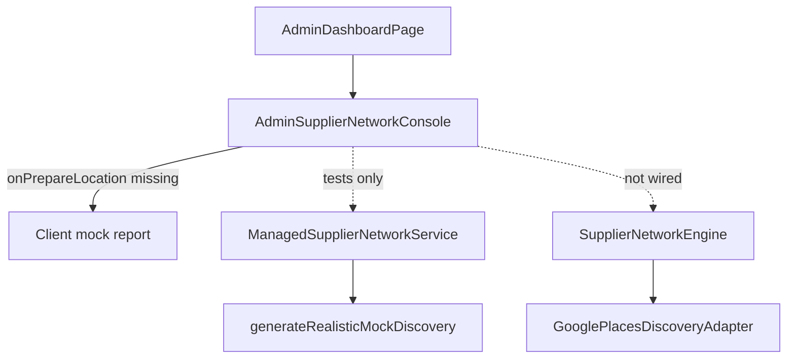

# OTP Location & Category Coverage — Forensic Trace (Read-Only)

**Workspace:** `G:\My Drive\otp`  
**Scenario:** Karnataka / Bengaluru / `560048` / **Electrical & Automation**  
**UI:** `AdminSupplierNetworkConsole` — “Location & Category Scope Specification”  
**Date of trace:** 2026-09-30  
**Production modified:** No  
**Source modified:** No  

**Evidence legend:** **VERIFIED** (code path cited) | **NOT OBSERVED** (no live run/API response) | **INFERRED** (logical follow-on, labeled)

---

## Five opening answers (with evidence)

### 1. Does Prepare Location Network actually call Google Places?

**For the deployed Admin UI as wired today: NO — Google Places is never invoked.**

| Layer | Verdict | Evidence |
|--------|---------|----------|
| Admin UI | **NO Google** | `AdminDashboardPage.tsx` renders `AdminSupplierNetworkConsole` **without** `onPrepareLocation` → console uses **client-side mock** only (`AdminSupplierNetworkConsole.tsx` L115–190). **VERIFIED** |
| Intended backend (`ManagedSupplierNetworkService`) | **NO Google** | `prepareLocationNetwork` → `executeControlledDiscovery` → `generateRealisticMockDiscovery` (in-memory mock rows; labels provider `GOOGLE_PLACES` but no adapter import). **VERIFIED** `managed-supplier-network-service.ts` L369–445, L450–460, L752–797 |
| Supplier Network Engine (RFQ / SNE path) | **Not reached by this UI** | SNE registers `GooglePlacesNetworkAdapter` (`create-otp-services.ts` L117–121) but admin console does not call SNE or `managedSupplierNetwork` via HTTP/action. **VERIFIED** |
| `GooglePlacesDiscoveryAdapter` (real integration surface) | **Only if another caller invokes `discover()` / `discoverWithFallbackLadder()`** | Admin pre-warm path does not. **VERIFIED** |

**NOT OBSERVED:** Live HTTP to `maps.googleapis.com` from this UI flow.

---

### 2. What exact Google query does OTP generate for 560048 + Electrical & Automation?

**Only on the Google Places adapter path** (`GooglePlacesDiscoveryAdapter.discoverWithFallbackLadder`), and **only when** `apiKey` is set, `isTruthfulLive`, quota allows, and a custom `fetchFn` is supplied:

**Single Text Search query string (URL-encoded):**

```text
{criteria.category} suppliers in {city} {pinCode}
```

**For this scenario (defaults in adapter if fields omitted):**

```text
Electrical & Automation suppliers in Bengaluru 560048
```

**Endpoint:** `https://maps.googleapis.com/maps/api/place/textsearch/json?query=...&key=...`  
**VERIFIED** `google-places-discovery-adapter.ts` L181–182, L356–360.

**Query count:** **1** Text Search per `discoverWithFallbackLadder` invocation when Tier-1 live path runs with `fetchFn`. **VERIFIED** L347–401.

**Without `fetchFn` but with API key:** Tier-1 uses `getSimulatedLivePayload()` (hard-coded pilot rows), **not** the Text Search URL. **VERIFIED** L375–378, L485–513.

**Without API key:** Tier-1 skipped; query string **not sent**. **VERIFIED** L192–200, L347–348.

**Category mapping:** No separate taxonomy→Google mapping table. The **literal** UI/category string is interpolated into the query. Place Types from Google are **not** used as search filters (only copied from results into `types` on normalize). **VERIFIED** L359–372, L246–247.

**Synonyms / aliases:** None in query construction. Static Tier-3 uses substring checks on `category.toLowerCase()` (`electric`, `automation`, etc.). **VERIFIED** L457–470.

---

### 3. How is 560048 converted into a Google geographic search area?

**On the Google Places discovery path: it is not geocoded and no `locationBias`, `locationRestriction`, viewport, or radius is applied.**

- PIN and city appear **only as plain text** inside the Text Search `query` parameter. **VERIFIED** `google-places-discovery-adapter.ts` L358–360.
- **No** Geocoding API call in this adapter. **VERIFIED** (grep: only `textsearch` endpoint L182).
- `radiusKm` on criteria defaults to **25 km** only on **normalized candidate** `capability.serviceArea`, not on the Google request. **VERIFIED** L246–252.
- Static fallback entries embed coordinates in curated rows; those are **not** produced by geocoding 560048 at runtime. **VERIFIED** L79–124, L457–470.

**SNE post-processing:** `ProviderNeutralLocationIntelligence` compares PIN/city via Haversine or **POSTAL_PIN_EXACT** / **CITY_MATCH** — not Google geocoding. **VERIFIED** `supplier-network-engine.ts` L675–685, `provider-neutral-location-intelligence.ts` L69–81.

**Managed pre-warm service:** Scope matching uses pin/city string equality on stored supplier locations (`getSuppliersInScope`). **VERIFIED** `managed-supplier-network-service.ts` L716–733.

---

### 4. Is the &lt;30-day cache preventing fresh Google discovery?

**For the Admin “Prepare Location Network” button as shipped: the checkbox and cache are largely non-functional relative to Google** because the UI never calls backend services (**VERIFIED** `AdminDashboardPage.tsx` L754–757).

**Three separate cache mechanisms exist in code:**

| Cache | Key | TTL / window | What bypasses | Wired to admin UI? |
|--------|-----|----------------|---------------|---------------------|
| **ManagedSupplierNetworkService** in-memory scope | `state:city:pincode:category` (lowercase) | `freshnessWindowDays` default **30** (`DEFAULT_SUPPLIER_REFRESH_POLICY`) | `forceRefresh: true` skips early return when status `FRESH` | **NO** (not wired) **VERIFIED** `managed-supplier-network-service.ts` L127–128, L167, L383–400; `supplier-network-refresh.ts` L238–239 |
| **SupplierNetworkEngine** `discoveryCache` | `{category}::{pinCode\|city\|ALL}` | `DEFAULT_SOURCING_REFRESH_WINDOW_MS` = 30 days | `EngineDiscoveryRequest.forceRefresh` | **NO** for admin console **VERIFIED** `supplier-network-engine.ts` L92, L261–264, L312–338 |
| **GooglePlacesDiscoveryAdapter** `discoveryCache` | `{city}:{pin}:{category}` | `cacheTtlMs` default 30 days | `options.forceCacheRefresh` on `discoverWithFallbackLadder` only | **NO** — SNE calls `discover()` without `forceCacheRefresh` **VERIFIED** `google-places-discovery-adapter.ts` L169–171, L223–227, L411–423; `supplier-network-engine.ts` L509–518 |

**Admin UI “Force external provider refresh”:** Sets `forceRefresh` on the **would-be** `onPrepareLocation` callback (`executeDiscovery \|\| forceRefresh`). **Prepare Location Network** always passes `forceRefresh: true` because `executeDiscovery` is true. **Check Existing Coverage** passes `forceRefresh` only if checkbox checked. **VERIFIED** `AdminSupplierNetworkConsole.tsx` L99, L316–324.

**Empty Google results cached 30 days?**

- **Google adapter:** Writes cache **only** when `rawResults.length > 0`. Empty live result falls through to static/unavailable; **empty is not written** to adapter cache. **VERIFIED** `google-places-discovery-adapter.ts` L381–391, L445–454.
- **SNE:** After provider fan-out, **always** `discoveryCache.set(...)` including when `normalizedCandidates` is empty → **INFERRED** an all-provider-empty discovery could be cached 30 days at SNE layer. **VERIFIED** `supplier-network-engine.ts` L407–416.

**NOT OBSERVED:** Runtime cache state for production.

---

### 5. At exactly which layer do valid Google results disappear?

**For the actual Admin UI path (no `onPrepareLocation`):**

| Button | Layer where results become `[]` or absent |
|--------|-------------------------------------------|
| **Check Existing Coverage** | **UI mock branch** sets `suppliers: []`, `NEVER_DISCOVERED`, `knownSupplierCount: 0` when `executeDiscovery === false`. **VERIFIED** `AdminSupplierNetworkConsole.tsx` L150–171, L316. **No Google layer involved.** |
| **Prepare Location Network** | **UI mock branch** injects **2 fake suppliers** (not Google). **VERIFIED** L117–148, L324. |

**If `onPrepareLocation` were wired to `ManagedSupplierNetworkService.prepareLocationNetwork`:**

- Google results **never enter** the pipeline; mock generator always returns **3** suppliers on discovery. **VERIFIED** `managed-supplier-network-service.ts` L460, L752–797.
- “Empty” only before first discovery (`assessScopeFreshness` → `NEVER_DISCOVERED`) or quota/approval failure (`ok: false`, existing count may be 0). **VERIFIED** L151–162, L405–440.

**If buyer/RFQ path uses SNE + `GooglePlacesDiscoveryAdapter` (not admin UI):**

Valid Google-like rows can become `[]` at:

1. **Tier-1 skipped** — no API key / quota denied / exception. **VERIFIED** `google-places-discovery-adapter.ts` L347–407.
2. **Tier-1 empty `rawResults`** — no cache write; fall through. **VERIFIED** L381–402.
3. **Tier-3 static** — `getStaticReferenceCandidates` returns `[]` when PIN not `560048` electrical keyword match **and** not `560*` / Bengaluru city fallback. **VERIFIED** L457–482.
4. **Tier-4 UNAVAILABLE** — explicit `candidates: []`. **VERIFIED** L445–454.
5. **SNE** — provider timeout/error → `candidates: []` for that provider; combined empty if all providers empty. **VERIFIED** `supplier-network-engine.ts` L436–610.
6. **SNE cache** — serves prior empty composite for 30 days if step 5 occurred once. **INFERRED** L407–416.

**NOT OBSERVED:** Real Google JSON with non-zero `results` in this trace.

---

## Trace 1 — Check Existing Coverage

| Step | Component / function | Google? |
|------|----------------------|--------|
| UI | `AdminSupplierNetworkConsole` → `handleCheckCoverage(false)` | No |
| Handler param | `forceRefresh: false` (unless checkbox) | — |
| Parent | `AdminDashboardPage` — **no** `onPrepareLocation` | — |
| Fallback | Mock `ScopeCoverageReport`: `NEVER_DISCOVERED`, `suppliers: []` | No |
| API route | **None found** for this console | — |
| Server action | **None found** | — |
| `ManagedSupplierNetworkService` | **Not invoked** from UI | Would use in-memory `knownScopes` / `suppliers` only; **no DB query** in class body despite `repos?` ctor | No Google |
| DB | **NOT OBSERVED** from this UI path | — |
| Cache | UI mock only | — |
| UI result | Success message: “Coverage status assessed: NEVER_DISCOVERED”, 0 suppliers | — |

**Explicit:** **Check Existing Coverage does not call Google Places** in production wiring. It does not call any backend; it runs a **client-side mock** that reports zero coverage unless `onPrepareLocation` is injected (tests only). **VERIFIED**

**If backend were wired (hypothetical):** `prepareLocationNetwork` has **no read-only mode**; `executeDiscovery` is **not** passed to the service. For `NEVER_DISCOVERED` scope, **Check** would still trigger `executeControlledDiscovery` (same as prepare, minus forced refresh on `FRESH` scopes). **VERIFIED** interface L13–19 vs `prepareLocationNetwork` L369–445.

---

## Trace 2 — Prepare Location Network

### Actual UI chain (VERIFIED)

```
AdminSupplierNetworkConsole.handleCheckCoverage(true)
  → onPrepareLocation? MISSING in AdminDashboardPage
  → mock suppliers (2) + FRESH freshness
  → setReport / setMessage
```

### Documented/intended backend chain (not connected to UI)

```
ManagedSupplierNetworkService.prepareLocationNetwork(params)
  → assessScopeFreshness(scope)  [in-memory Map]
  → if FRESH && !forceRefresh → return report, externalCallsExecuted: 0
  → evaluateQuota('GOOGLE_PLACES', 'P4_SUPERADMIN_PROACTIVE', 2)
  → executeControlledDiscovery
       → generateRealisticMockDiscovery (NOT GooglePlacesDiscoveryAdapter)
       → merge into in-memory suppliers + observations (provider label GOOGLE_PLACES)
       → knownScopes.set(scopeKey, { lastDiscoveredAt, count })
  → generateCoverageReport
```

### SNE + Google chain (RFQ / `discoverCandidates`, not admin button)

```
SupplierNetworkEngine.discoverCandidates
  → [optional] SNE 30-day cache
  → executeProvider(GooglePlacesNetworkAdapter)
       → GooglePlacesDiscoveryAdapter.discover
            → discoverWithFallbackLadder
                 → Tier-1 LIVE (query or simulated payload)
                 → Tier-2 adapter cache
                 → Tier-3 static directory
                 → Tier-4 []
  → normalizeAndDeduplicate → SNE cache set
```

**Exact point Google Places API is called:** Only inside `GooglePlacesDiscoveryAdapter.discoverWithFallbackLadder` Tier-1 when `apiKey` + quota + **`fetchFn`** performs HTTP. **Otherwise never** (simulated payload or skip). **VERIFIED** L347–378.

**Persistence:** Admin managed service → in-memory `Map`s only in implementation reviewed; **no repository writes** in `executeControlledDiscovery`. **VERIFIED** `managed-supplier-network-service.ts` (no `this.repos` usage). DB observation schema exists in domain types but **NOT OBSERVED** wired here.

---

## Trace 3 — Category “Electrical & Automation”

| Question | Answer | Evidence |
|----------|--------|----------|
| OTP canonical taxonomy? | **Not as exact string** in `canonical-taxonomy.ts` (related: “Electrical Repair, Rewiring & Switchboard Work”). Admin list is **UI constant** `CANONICAL_CATEGORIES`. | `AdminSupplierNetworkConsole.tsx` L47–58; `canonical-taxonomy.ts` ~L462 |
| Internal id/code? | Managed service uses `scope.category.toUpperCase().replace(/\s+/g, '_')` → `ELECTRICAL_&_AUTOMATION` on generated entities. | `managed-supplier-network-service.ts` L518–519 |
| Google-specific mapping? | **None** — literal category in text query. | `google-places-discovery-adapter.ts` L358–360 |
| Google Place Types in search? | **No** — types only on normalized output from results/static. | L246–247, L371 |
| Queries generated | **1** text search when live+fetchFn | L356–360 |
| Zero matches possible? | **Yes** — Tier-4; or static `[]` outside Bangalore/`560*` rules; SNE could aggregate to empty. | L457–482, L445–454 |

**Could mapping yield ZERO matches?** There is **no taxonomy mapping step**; zero yields come from fallback rules or provider failures, not from a mapping table returning no queries.

---

## Trace 4 — Pincode 560048

| Mechanism | Used? |
|-----------|--------|
| Geocode API | **No** |
| Coordinates in search | **No** (text in query only) |
| Viewport / bounding box | **No** |
| `locationBias` / `locationRestriction` | **No** |
| PIN as text in query | **Yes** (`... in Bengaluru 560048`) |
| Post-result PIN filter | **No** in Google adapter; static tier gates on PIN `560048` or `560*` prefix |
| SNE distance | PIN exact match boosts locality via `ProviderNeutralLocationIntelligence` | 

**VERIFIED** paths above.

---

## Trace 5 — 30-day cache (detail)

**ManagedSupplierNetworkService**

- **Cached concept:** “scope freshness” timestamp in `knownScopes` + supplier entities in `suppliers` Map.
- **Key:** `state:city:pincode:category` (lowercase). **VERIFIED** L127–128.
- **Age:** `ageInDays = floor((now - lastDiscoveredAt) / 86400000)`; `< freshnessWindowDays` (30) → `FRESH`. **VERIFIED** L165–179.
- **`forceRefresh`:** Bypasses only the **FRESH early return**; still runs discovery if stale/never. **VERIFIED** L383–400.
- **Does not** call `GooglePlacesDiscoveryAdapter` or clear SNE/Google adapter caches.

**SupplierNetworkEngine**

- **Key:** `category::pinCode` (or city or `ALL`). **VERIFIED** L261–264.
- **`forceRefresh` on `EngineDiscoveryRequest`:** Bypasses SNE cache. **VERIFIED** L312–338.
- **Admin checkbox does not set this** (UI not connected).

**GooglePlacesDiscoveryAdapter**

- **Key:** `city:pin:category`. **VERIFIED** L223–227.
- **`forceCacheRefresh`:** Bypass Tier-2 only. **Not** passed from SNE `discover()`. **VERIFIED** L411, L509–518.

---

## Trace 6 — “External provider”

In UI copy: “Force **external provider** refresh” — refers to **policy intent** (bypass 30-day **managed** freshness), not a runtime provider switch in the mock UI.

**Provider enum (`SupplierNetwork`):** `ONDC`, `BNI`, `ASSOCIATION`, `DIRECT`, `LOCAL_REGISTRY`, `GOOGLE_PLACES`. **VERIFIED** `packages/domain/src/enums/supplier-network.ts`.

**Managed service quota / observations:** Hard-coded provider name **`GOOGLE_PLACES`** for external discovery accounting. **VERIFIED** `managed-supplier-network-service.ts` L291, L404, L473.

**SNE registration (`createOtpServices`):** Google Places **credential-gated**; ONDC/BNI/Association **disabled gate**; Direct stub always returns one row. **VERIFIED** `create-otp-services.ts` L111–141.

**“External provider” in practice for pre-warm backend:** Labeled Google; implementation is **mock discovery**, not ONDC/Google HTTP.

---

## Trace 7 — “Location Network” (internal meaning)

From code behavior (not marketing):

- **Managed pre-warm:** In-memory **regional supplier network** per scope — discovered/merged `NetworkSupplierEntity` rows with lifecycle stages (`DISCOVERED_IN_AREA` … `GST_VERIFIED`), locations, categories, provenance providers. **VERIFIED** `supplier-network-refresh.ts` L370–405, `managed-supplier-network-service.ts` L533–574.
- **Not** synonymous with “OTP registered suppliers” only — includes discovered-not-registered entities.
- **SNE:** Normalized **candidate** list for RFQ matching across networks.
- **Google adapter:** **Discovery candidates** with `DISCOVERED_IN_AREA` trust boundary.

---

## Trace 8 — Every point valid Google results can become `[]` (SNE path)

1. Missing `GOOGLE_PLACES_API_KEY` / `GOOGLE_MAPS_API_KEY` → Tier-1 skipped. **VERIFIED**
2. Quota guard denies reservation → Tier-1 skipped. **VERIFIED** L350–352
3. Live exception → fall through. **VERIFIED** L403–406
4. `fetchFn` returns no `results` array or empty array → no cache write → static/unavailable. **VERIFIED** L362–374, L381–402
5. Static directory miss → `[]`. **VERIFIED** L482
6. Tier-4 UNAVAILABLE. **VERIFIED** L445–454
7. SNE provider OPEN circuit / timeout → provider contributes `[]`. **VERIFIED** `supplier-network-engine.ts` L479–494, L588–609
8. SNE caches composite empty 30 days. **INFERRED** L407–416
9. **Admin UI mock Check** → `[]` by design. **VERIFIED**

---

## Trace 9 — Control: Plumbing & Water Systems vs Electrical

**Admin UI category string:** `Plumbing & Water Systems` (in `CANONICAL_CATEGORIES`). **VERIFIED** `AdminSupplierNetworkConsole.tsx` L50.

**Google Text Search (if Tier-1 live+fetchFn):**

```text
Plumbing & Water Systems suppliers in Bengaluru 560048
```

**One query**, literal category. **VERIFIED** query template L358–360.

**Static Tier-3 for `560048` + Plumbing:**

- Does not match electrical keyword list. **VERIFIED** L461–468.
- **Falls through** to Bangalore rule: `pin.startsWith('560')` → returns **same** `BANGALORE_560048_ELECTRICAL_STATIC_DIRECTORY` with business names suffixed `({category})`. **VERIFIED** L473–479.

**Electrical & Automation at 560048:** Direct static directory match (4 entries). **VERIFIED** L461–470.

**Conclusion:** For PIN **560048**, **both** categories get **non-empty** static fallback in `GooglePlacesDiscoveryAdapter` — problem is **not** category-specific static mapping for this PIN. **VERIFIED**

**Admin UI:** Both categories still hit **same mock behavior** (0 on Check, 2 on Prepare) — **not** Google integration. **VERIFIED**

**Non-560 / non-Bengaluru Plumbing:** Static `[]` → Tier-4 more likely than Electrical-specific bug. **VERIFIED** L473–482.

---

## File index (primary evidence)

| File | Role |
|------|------|
| `apps/web/src/features/admin/components/AdminSupplierNetworkConsole.tsx` | UI, both buttons, mock fallback |
| `apps/web/src/features/admin/pages/AdminDashboardPage.tsx` | Renders console **without** backend hookup |
| `packages/services/src/services/managed-supplier-network-service.ts` | Pre-warm backend (mock external discovery) |
| `packages/services/src/gis/google-places-discovery-adapter.ts` | Google Text Search + 4-tier ladder + static 560048 |
| `packages/services/src/discovery/supplier-network-engine.ts` | SNE cache + provider dispatch |
| `packages/services/src/factory/create-otp-services.ts` | Wires SNE + Google adapter for RFQ stack |
| `packages/services/src/discovery/networks/supplier-network-adapters.ts` | `GooglePlacesNetworkAdapter` export |
| `packages/domain/src/types/supplier-network-refresh.ts` | 30-day policy, scope report types |
| `packages/domain/src/enums/supplier-network.ts` | Provider enum |

---

## Summary diagram (actual vs intended)



---

**End of forensic trace. Production was not modified. Code was not modified.**
