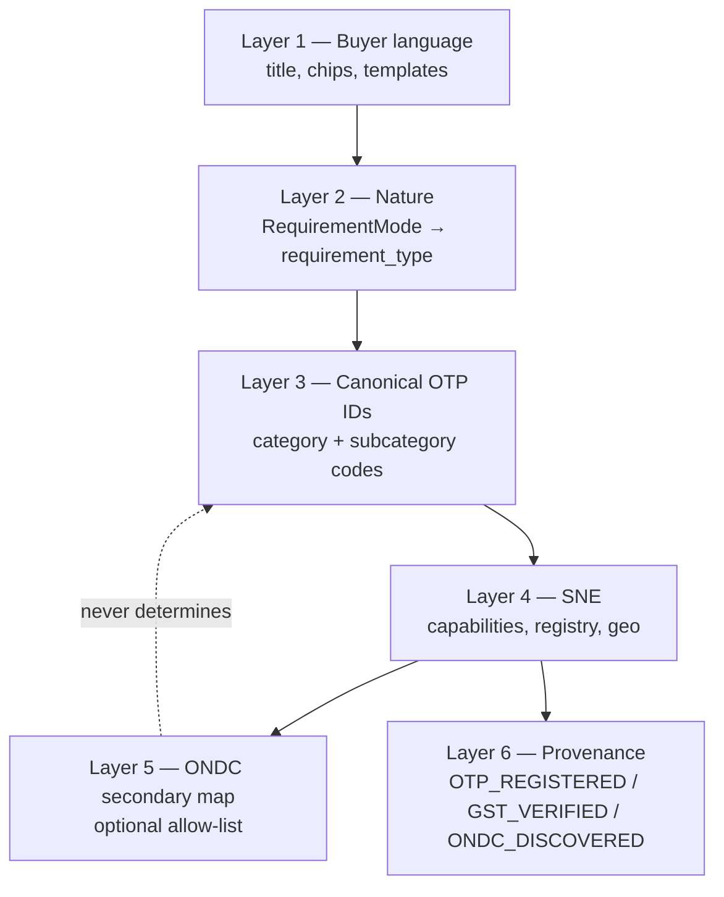

# OTP-TAXONOMY-02 — Target Procurement Taxonomy & Buyer Model (Design Only)

**Date:** 2026-09-29  
**Role:** Principal Product Architect + Procurement Domain Architect + UX Information Architect + Data Migration Architect  
**Baseline document:** `OTP Golden Reconstruction/Taxonomy/OTP-TAXONOMY-01-READONLY-RECONSTRUCTION.md`  
**Scope:** Proposed target state — recommendations only  
**Code / DB / deploy / ONDC live / TAXONOMY-03 modified:** **NO** (this file only)

---

## 1. Executive Summary

OTP’s **target procurement taxonomy** keeps the existing **`requirement_categories` / `requirement_subcategories` stable IDs** as the canonical Layer-3 model (16 top-level categories, **160 subcategory codes** in repo seeds: 145 in `00019`, +10 in `00058`, +5 in `00059`). Buyers continue the journey **TELL → REVIEW → DECIDE → TRACK** with **Identity-Protected Competitive Sourcing**; they choose **category → subcategory → procurement mode (`RequirementMode`)**, from which **`requirement_type` (`PRODUCT` | `SERVICE` | `PROJECT`)** is derived server-side — never from ONDC.

**Target corrections (PROPOSED, not implemented):** wire **Describe / Other** to `general_other.custom_requirement` (stable UUID); enforce **nature-first disambiguation** for CCTV, paint, gym, electrical materials vs work, plumbing SKUs vs visits; add **minimal new leaves** only where repo evidence shows a gap (domestic RO purifier product, gym equipment supply vs AMC); fix **display labels and default modes** without re-parenting historical IDs; move ONDC to a **secondary subcategory+nature allow-list** behind SNE — no title heuristics, no buyer-visible RET codes.

**CanonicalTaxonomyService:** remain **non-authoritative** for intake; **DB taxonomy is the product source of truth**; parallel in-memory nodes should be **retired from runtime paths** after fixture sync (architecture decision in §25).

**Certification intent:** Target taxonomy defined, dispositions complete, examples/templates specified, Other path specified, historical compatibility addressed, ONDC bounded — **pending PO approval of open decisions** (§30).

---

## 2. Baseline

| Item | Value | Evidence label |
|------|--------|----------------|
| **HEAD SHA** | `9cb4a037418893cbaf5c90b9f108884d32a1601b` | OBSERVED |
| **Branch** | `main` | OBSERVED |
| **Migration ceiling** | `00222_otp_document_issuance_snapshots.sql` | OBSERVED |
| **Dirty (tracked)** | R2-31 certification MD; `SiteHeader.tsx`; `SiteLayout.tsx`; `create-otp-services.ts`; `ondc-network-service.ts`; `ondc-realtime.test.ts` | OBSERVED |
| **Dirty (untracked)** | Large `OTP Golden Reconstruction/**`; test/scripts; `.vitest/` | OBSERVED |
| **ONDC-related dirty** | **YES** — three tracked service/test files above | OBSERVED |
| **R2-31-related dirty** | **YES** — certification MD + site chrome | OBSERVED |
| **Wallet-related dirty** | **NO** among tracked `M` files | OBSERVED |
| **TAXONOMY-01 path** | `OTP Golden Reconstruction/Taxonomy/OTP-TAXONOMY-01-READONLY-RECONSTRUCTION.md` | OBSERVED |
| **Stash / tree** | Not modified by this task | OBSERVED |

---

## 3. TAXONOMY-01 Evidence Baseline

TAXONOMY-01 findings **re-validated against repo at baseline SHA** (read-only). **No material contradictions** vs TAXONOMY-01; one **precision note** on subcategory count (see row 1).

| # | TAXONOMY-01 finding | Re-validation | Delta |
|---|---------------------|---------------|-------|
| 1 | `requirement_*` = operational buyer taxonomy | `00019`+extensions; `apps/web/src/features/intake/api/taxonomy.ts` | **Count:** 160 subcategory **codes** seeded (145+10+5), not “80+” alone — TAXONOMY-01 used inventory estimate |
| 2 | `CanonicalTaxonomyService` not wired to web wizard | **Zero** matches under `apps/web` | None |
| 3 | Procurement mode → Product/Service/Project | `requirement-mode.ts` + `00019` defaults | None |
| 4 | CCTV equipment vs integration separate DB leaves | `cctv_surveillance` (PRODUCT_MATERIAL) vs `cctv_it_integration` (PROJECT_CONTRACT) | None |
| 5 | Paint supply vs painting service separate | `paints_coatings` (PRODUCT) vs `painting_finishing` (SERVICE default) vs `00058` painting service subcats | None |
| 6 | Gym equipment vs maintenance; mode inconsistency | `gym_fitness_equipment` default **SERVICE** in `00059` while name implies supply+AMC | None |
| 7 | Electrical/plumbing materials vs work separated | `electrical_items_cables` vs `electrical_contracting`; `plumbing_sanitary_fittings` vs `plumbing_services` / `plumber_technician` | None |
| 8 | UI `OTHER` ≠ `custom_requirement` | `Tier1TellOtpCard.tsx` values `'OTHER'` | None |
| 9 | ONDC keyword/string heuristics | `mapCategoryToOndcDomain` in `ondc-network-service.ts` | None |
| 10 | Mapper emits B2B10, SRV11, SRV13 off enabled-sheet evidence | Same function + `ondc-realtime.test.ts` expectations | None |
| 11 | `ONDC_DISCOVERY_DOMAIN` global override | `resolveOndcDiscoveryDomain` + `.env.production.example` | None |
| 12 | Smart Merit not ONDC/taxonomy-driven | `quote-evaluation-service-impl.ts` — price, delivery, warranty, rating, performance only | None |
| 13 | SNE = discovery boundary | `SupplierNetworkEngine` + `CompositeDiscoveryService` in factory | None |
| 14 | Historical RFQs must survive normalization | FK on `requirements.subcategory_id`; snapshots/report MVs — design assumes **stable IDs** | None |

---

## 4. Target Design Principles

| ID | Principle | Target application |
|----|-----------|-------------------|
| **A** | Buyer language first | Chips, templates, category names in plain Hindi-English mix; no Beckn/RET in UI |
| **B** | Nature explicit | Mode picker before keyword suggestions apply; derived `requirement_type` shown at REVIEW |
| **C** | Stable IDs, not display labels | All matrix actions preserve `code` unless ADD NEW |
| **D** | Preserve historical data | RETAIN + aliases + effective-dated display; no destructive re-parent |
| **E** | Product ≠ Service ≠ Project | Enforced via mode + subcategory pairing (CCTV product vs install project, etc.) |
| **F** | ONDC never determines OTP category | Mapping Layer 5 only; intake never reads ONDC taxonomy |
| **G** | Other / Describe is real | `custom_requirement` + free text; submit-able; SNE fallback; ONDC = no mapping |
| **H** | Simple UX | One shared tree; persona via examples not duplicate taxonomies; TELL stays ≤3 picks |

---

## 5. Current → Target Taxonomy Matrix

### 5.1 Top-level category dispositions (all 16)

| Current ID | Current label | Action | Target label | Reason | Historical compatibility |
|------------|---------------|--------|--------------|--------|---------------------------|
| `construction_infrastructure` | Construction & Infrastructure | **RETAIN** | (same) | Core civil/materials lane | All FKs unchanged |
| `electrical_power` | Electrical & Power | **RETAIN** | (same) | SKUs + contracting already split | Unchanged |
| `machinery_engineering` | Machinery & Engineering | **RETAIN** | (same) | Demo + MSME fit | Unchanged |
| `industrial_supplies_hardware` | Industrial Supplies & Hardware | **RETAIN** | (same) | RET1B candidate only at ONDC layer | Unchanged |
| `chemicals_process_materials` | Chemicals & Process Materials | **RETAIN** | (same) | Includes `paints_coatings` product lane | Unchanged |
| `textile_apparel` | Textile & Apparel | **RETAIN** | (same) | RET12 mapping candidate | Unchanged |
| `agriculture_commodities` | Agriculture & Commodities | **RETAIN** | (same) | Commodity trading modes | Unchanged |
| `packaging_printing` | Packaging & Printing | **RETAIN** | (same) | MSME packaging | Unchanged |
| `property_facility_management` | Property & Facility Management | **RETAIN** | (same) | RWA-heavy services | Unchanged |
| `safety_security` | Safety & Security | **RENAME DISPLAY LABEL ONLY** | “Safety, Security & Surveillance” | Clarify product vs guard services | ID unchanged |
| `water_environmental` | Water & Environmental Solutions | **RETAIN** | (same) | Borewell/water cluster | Unchanged |
| `it_electronics_digital` | IT, Electronics & Digital | **RETAIN** | (same) | IT + integration project lane | Unchanged |
| `logistics_transportation` | Logistics & Transportation | **RETAIN** | (same) | Includes `vehicle_repair_fleet_service` | Unchanged |
| `professional_skilled_services` | Professional & Skilled Services | **RETAIN** | (same) | Technician visits | Unchanged |
| `general_other` | General / Other | **RENAME DISPLAY LABEL ONLY** | “Describe your requirement” | Align with Other path | Wire UI to this category |
| `furniture_fixtures` | Furniture, Fixtures & Interiors | **RETAIN** | (same) | Added in `00058` | Unchanged |

### 5.2 Procurement-critical subcategories (explicit actions)

| Current ID | Current label | Parent | Current nature (mode→type) | Target label | Target parent | Target nature | Action | Reason | Historical compatibility |
|------------|---------------|--------|----------------------------|--------------|---------------|---------------|--------|--------|---------------------------|
| `cctv_surveillance` | CCTV & surveillance | `safety_security` | PRODUCT | “CCTV cameras & recording equipment (supply)” | same | PRODUCT | **RENAME DISPLAY + ADD ALIAS** keywords | Product lane; block install verbs when mode=PRODUCT_MATERIAL | RETAIN ID |
| `cctv_it_integration` | CCTV & IT integration | `it_electronics_digital` | PROJECT | “CCTV / NVR turnkey installation” | same | PROJECT | **RENAME DISPLAY ONLY** | Project lane vs equipment | RETAIN ID |
| `security_services` | Security services | `safety_security` | SERVICE | (same) | same | SERVICE | **ADD ALIAS** negative_kw | Prevent “security”→CCTV product | RETAIN ID |
| `paints_coatings` | Paints & coatings | `chemicals_process_materials` | PRODUCT | “Industrial & decorative paint (material supply)” | same | PRODUCT | **RENAME DISPLAY ONLY** | Canonical product paint SKU | RETAIN ID |
| `painting_finishing` | Painting & finishing | `construction_infrastructure` | SERVICE* | “Paint, putty & primer (materials only)” | same | **PRODUCT** | **NEEDS PRODUCT DECISION** | Seed default is SERVICE but capability `paint_supply`; target default **PRODUCT_MATERIAL** | Same ID; migration adjusts default_mode only |
| `home_interior_exterior_painting` | Home… Painting | `property_facility_management` | SERVICE | (same) | same | SERVICE | **RETAIN** | Flat painting service | Unchanged |
| `rwa_society_exterior_repainting` | RWA… Repainting | `property_facility_management` | SERVICE | (same) | same | SERVICE | **RETAIN** | RWA persona | Unchanged |
| `painting_maintenance` | Building painting & maintenance | `property_facility_management` | SERVICE | (same) | same | SERVICE | **RETAIN** | Legacy label; overlaps 00058 — keep for FK | Unchanged |
| `gym_fitness_equipment` | Gym & Fitness Equipment Supply & AMC | `property_facility_management` | SERVICE (seed) | “Gym equipment supply OR AMC (pick mode)” | same | **mode-dependent** | **SPLIT** (preferred) or **NEEDS PRODUCT DECISION** | See §5.3 | See split IDs |
| `gym_fitness_equipment_supply` | — | — | — | “Commercial gym equipment (supply)” | `property_facility_management` | PRODUCT | **ADD NEW** | Resolves C-08 | New ID; old ID maps via alias table |
| `gym_fitness_amc` | — | — | — | “Gym equipment AMC & servicing” | `property_facility_management` | SERVICE/AMC | **ADD NEW** | Maintenance lane | New ID |
| `swimming_pool_maintenance` | Swimming Pool Maintenance… | `property_facility_management` | AMC→SERVICE | (same) | same | SERVICE | **RETAIN** | Pool AMC | Unchanged |
| `electrical_items_cables` | Electrical items & cables | `electrical_power` | PRODUCT | (same) | same | PRODUCT | **RETAIN** | Materials | Unchanged |
| `electrical_contracting` | Electrical contracting | `electrical_power` | PROJECT | (same) | same | PROJECT | **RETAIN** | Wiring/project | Unchanged |
| `electrician_technician` | Electrician & technician | `professional_skilled_services` | SERVICE | (same) | same | SERVICE | **RETAIN** | Visit/repair | Unchanged |
| `plumbing_sanitary_fittings` | Plumbing & sanitary fittings | `construction_infrastructure` | PRODUCT | (same) | same | PRODUCT | **RETAIN** | CP fittings supply | Unchanged |
| `plumbing_services` | Plumbing services | `property_facility_management` | SERVICE | (same) | same | SERVICE | **RETAIN** | Facility plumbing | Unchanged |
| `plumber_technician` | Plumber | `professional_skilled_services` | SERVICE | (same) | same | SERVICE | **RETAIN** | Visit | Unchanged |
| `bathroom_sanitary_renovation` | Bathroom Renovation… | `property_facility_management` | SERVICE | (same) | same | SERVICE | **RETAIN** | Fixture replacement | Unchanged |
| `borewell_drilling` | Borewell drilling | `water_environmental` | SERVICE | (same) | same | **SERVICE or PROJECT** | **NEEDS PRODUCT DECISION** | Site drilling; use PROJECT_CONTRACT when turnkey civil included | RETAIN ID |
| `borewell_motor_pump` | Borewell motor & pump supply | `water_environmental` | PRODUCT | (same) | same | PRODUCT | **RETAIN** | Pump SKU | Unchanged |
| `motor_rewinding` | Motor rewinding & repair | `water_environmental` | REPAIR→SERVICE | (same) | same | SERVICE | **RETAIN** | Template anchor | Unchanged |
| `water_treatment_plant` | Water treatment plant | `water_environmental` | PROJECT | “Commercial / industrial WTP & large RO plant” | same | PROJECT | **RENAME DISPLAY ONLY** | De-conflate from domestic RO | RETAIN ID |
| `domestic_ro_purifier` | — | — | — | “Domestic RO / water purifier (product)” | `water_environmental` | PRODUCT | **ADD NEW** | Gap per TAXONOMY-01; supplier seeds exist without leaf | New ID |
| `domestic_ro_amc` | — | — | — | “Domestic RO service & filter AMC” | `water_environmental` | AMC→SERVICE | **ADD NEW** | Service lane | New ID |
| `water_geyser_supply` | — | — | — | “Water heater / geyser (supply)” | `water_environmental` | PRODUCT | **NEEDS PRODUCT DECISION** | No seed today; supplier capabilities only | Optional ADD NEW |
| `office_furniture_workstations` | Office Furniture… | `furniture_fixtures` | PRODUCT | (same) | same | PRODUCT | **RETAIN** | MSME/RWA office | Unchanged |
| `home_living_furniture` | Home & Residential… | `furniture_fixtures` | PRODUCT | (same) | same | PRODUCT | **RETAIN** | Individual | Unchanged |
| `rwa_clubhouse_furniture` | RWA Clubhouse… | `furniture_fixtures` | PRODUCT | (same) | same | PRODUCT | **RETAIN** | RWA | Unchanged |
| `modular_carpentry_kitchen` | Modular Kitchen… | `furniture_fixtures` | SERVICE | (same) | same | PROJECT or SERVICE | **NEEDS PRODUCT DECISION** | Custom fit-out — default PROJECT_CONTRACT when turnkey | RETAIN ID |
| `custom_requirement` | Custom requirement | `general_other` | OTHER→null type | “Describe what you need (custom)” | same | mode buyer-selected | **RETAIN + wire UI** | C-02 resolution | Unchanged ID |
| `general_products` | General products | `general_other` | PRODUCT | (same) | same | PRODUCT | **RETAIN** | Fallback product | Unchanged |
| `general_services` | General services | `general_other` | SERVICE | (same) | same | SERVICE | **RETAIN** | Fallback service | Unchanged |

\*Current nature from `default_requirement_mode` in seeds.

### 5.3 Gym split (preferred target)

| Legacy ID | Target handling |
|-----------|-----------------|
| `gym_fitness_equipment` | **DEPRECATE** (display only after effective date) → map to `gym_fitness_equipment_supply` or `gym_fitness_amc` via **non-destructive alias** row; historical RFQs keep original `subcategory_id` |

### 5.4 Compact RETAIN block (unchanged IDs)

**119 subcategory codes** across the 16 top-level categories **RETAIN** with same parent, same code, same target nature as current seed defaults (full list = all codes in `00019` §3 minus rows in §5.2, plus `indoor_outdoor_sports_games`, `vehicle_repair_fleet_service`, furniture codes not listed, etc.). **No silent omission:** every top-level disposition is in §5.1; every ambiguous vertical in §5.2; long tail explicitly **RETAIN**.

**Not added (no OTP seed evidence):** standalone **Grocery / Home Appliances** top-level — **NOT PROPOSED**; use `general_products` or `computers_laptops` / existing leaves until PO adds vertical.

---

## 6. Product Taxonomy

**Definition:** Tangible SKUs, catalog lines, deliverable goods — buyer mode **`PRODUCT_MATERIAL`** or **`COMMODITY_TRADING`** → `RequirementType.PRODUCT`.

**Primary OTP product lanes (existing IDs):**

- Construction materials: `cement_concrete`, `aggregates_sand`, `tiles_flooring`, `plumbing_sanitary_fittings`, …
- Electrical SKUs: `electrical_items_cables`, `switchgear_panels`, `dg_sets`, `ups_inverters`, `lighting_fixtures`, …
- Chemicals: `paints_coatings`, `industrial_chemicals`, …
- Security products: `cctv_surveillance`, `ppe_safety_gear`, `access_control`, …
- Water products: `borewell_motor_pump`, **target** `domestic_ro_purifier`, `submersible_pump_supply` capability path
- Furniture: all `furniture_fixtures` PRODUCT-default subcats except repair/carpentry
- IT products: `computers_laptops`, `networking_equipment`, `printers_peripherals`, …
- Textile/agri/industrial/packaging: respective `*_supply` / commodity subcats

**Target rule:** Product subcategories **must not** use ONDC service domains; optional RET1B/RET1C/RET12/RET14 mapping only at Layer 5.

---

## 7. Service Taxonomy

**Definition:** Time, skill, AMC, visits, repairs — modes **`SERVICE`**, **`REPAIR_MAINTENANCE`**, **`AMC`**, **`PROFESSIONAL_SERVICE`**, etc. → `RequirementType.SERVICE` (except modes mapped to PROJECT).

**Primary lanes:**

- Facility: `housekeeping_cleaning`, `lift_amc`, `pest_control`, `swimming_pool_maintenance`, painting service subcats (`home_interior_exterior_painting`, …)
- Trades: `electrician_technician`, `plumber_technician`, `plumbing_services`
- Water services: `motor_rewinding`, `water_tank_cleaning`, `borewell_drilling` (when not contracted as project), **target** `domestic_ro_amc`
- Security: `security_services`, `fire_extinguisher_amc`
- Gym: **target** `gym_fitness_amc` (not equipment supply)

---

## 8. Project / Work Taxonomy

**Definition:** Multi-step site execution, bundled supply+install, contracts — mode **`PROJECT_CONTRACT`** → `RequirementType.PROJECT`.

**Primary lanes:**

- `civil_work`, `electrical_contracting`, `solar_pv`, `cctv_it_integration`, `fire_safety_systems`, `water_treatment_plant`, `sewage_treatment_plant`, `rainwater_harvesting`, `iot_automation`
- Large painting/facility: `rwa_society_exterior_repainting` (service type but project-scale — stays SERVICE type with project-style attributes; PO may allow PROJECT mode override at REVIEW)

**Target rule:** Keywords like “installation” **must not** override explicit **Award a project or contract** mode.

---

## 9. Product/Service/Project Classification Model

```
Buyer text + optional chip
        ↓
[1] Pick category (buyer language)
        ↓
[2] Pick subcategory (canonical code)
        ↓
[3] Pick RequirementMode (nature intent) — REQUIRED before parser auto-fill may apply
        ↓
[4] Server derives requirement_type (INV-007)
        ↓
[5] Structured attributes from category_attribute_definitions
        ↓
[6] SNE discovery (subcategory + capabilities + nature + geo)
        ↓
[7] Optional ONDC adapter (allow-list only)
```

| Step | Authority | Client trust |
|------|-----------|--------------|
| Mode | Buyer | Never skip |
| Subcategory | Buyer (parser suggests, does not override) | UUID FK |
| `requirement_type` | Server | Never client-supplied |
| ONDC domain | Config table + pilot env | Never buyer-facing |

**Keyword rule (PROPOSED):** Parser may **suggest** subcategory only when confidence ≥ threshold; if mode contradicts suggestion (e.g. PROJECT + `cctv_surveillance`), **keep subcategory** but **surface REVIEW warning** — do not auto-switch to integration leaf without buyer confirm.

---

## 10. Ambiguous Requirement Resolution

| Ambiguity test | Wrong collapse | Target resolution |
|----------------|----------------|-------------------|
| **CCTV** cameras only vs install | RET14 + `cctv` title for both | Product → `cctv_surveillance` + PRODUCT_MATERIAL; Project → `cctv_it_integration` + PROJECT_CONTRACT |
| **Water** purifier vs plant vs borewell | `water` SQL heuristic | Product RO → `domestic_ro_purifier`; Plant → `water_treatment_plant`; Drilling → `borewell_drilling`; Motor → `motor_rewinding` vs `borewell_motor_pump` via keywords in seed |
| **Gym** equipment vs AMC | `gym`→SRV13 | Split leaves; mode locks nature |
| **Electrical** wire vs wiring job | SRV11 default | Materials → `electrical_items_cables`; Project → `electrical_contracting`; Visit → `electrician_technician` |
| **Plumbing** fittings vs leak visit | Single “plumbing” | Fittings → `plumbing_sanitary_fittings`; Visit → `plumber_technician`; Society line → `plumbing_services` |
| **Painting** paint tins vs contractor | `paint`→SRV13 | Tins → `paints_coatings` or retarget `painting_finishing` as PRODUCT; Contractor → `home_interior_exterior_painting` |
| **Borewell** drill vs motor vs rewind | `borewell` alone | Drilling phrases → `borewell_drilling`; Buy pump → `borewell_motor_pump`; Rewind → `motor_rewinding` |
| **Pool** chemicals vs AMC | title `%pool%` | `swimming_pool_maintenance` + AMC mode |
| **Furniture** buy vs modular fit-out | — | PRODUCT subcats vs `modular_carpentry_kitchen` + PROJECT or SERVICE per PO |

---

## 11. Buyer-Facing Category Model

**Single tree** for Individual, RWA, MSME — persona differences only in **examples**, **suggested subcategory ordering**, and **template pre-fill**.

**TELL controls (target):**

1. Title / voice / paste (optional)
2. Category dropdown — includes **Describe your requirement** (`general_other`)
3. Subcategory — filtered; **Custom** → `custom_requirement`
4. **How do you want to procure?** — full `REQUIREMENT_MODE_LABELS`
5. Location, timing, budget
6. Dynamic attributes (when defined)

**REVIEW:** Show category label + mode label + derived nature badge (Product / Service / Project) — **no RET codes**.

**Chips (existing):** map to **subcategory hints**, not ONDC — e.g. Security chip → suggest `cctv_surveillance` **after** mode chosen.

---

## 12. Individual Examples

| Category (subcategory) | Nature | Example (short) |
|------------------------|--------|-----------------|
| `motor_rewinding` | SERVICE | “10 HP borewell motor burnt — rewind at home, Whitefield” |
| `home_interior_exterior_painting` | SERVICE | “2 BHK interior emulsion, 900 sqft” |
| `cctv_surveillance` | PRODUCT | “4x 4MP IP cameras + NVR — supply only” |
| `home_living_furniture` | PRODUCT | “Sheesham dining set — delivery only” |
| `domestic_ro_purifier` | PRODUCT | “RO purifier 10L — Kent/AO Smith equivalent” |
| `custom_requirement` | OTHER | “Antique door restoration — not listed” |

---

## 13. RWA Examples

| Category (subcategory) | Nature | Example (short) |
|------------------------|--------|-----------------|
| `lift_amc` | SERVICE | “2 lifts, 12 stops — annual AMC” |
| `rwa_society_exterior_repainting` | SERVICE | “3 towers, 1.2L sqft exterior + scaffolding” |
| `swimming_pool_maintenance` | AMC | “Clubhouse pool — monthly chemistry + filtration AMC” |
| `cctv_it_integration` | PROJECT | “Perimeter CCTV + clubhouse NVR — turnkey” |
| `rwa_clubhouse_furniture` | PRODUCT | “100 banquet chairs — stackable” |
| `gym_fitness_amc` | AMC | “Society gym — quarterly PM on 8 treadmills” |

---

## 14. MSME Examples

| Category (subcategory) | Nature | Example (short) |
|------------------------|--------|-----------------|
| `cnc_machining` | JOB_WORK | “500 SS316 flanges — drawing attached” |
| `cotton_yarn` | PRODUCT | “40s combed cotton yarn 2 tons” |
| `electrical_items_cables` | PRODUCT | “3.5 core copper cable 500m” |
| `office_furniture_workstations` | PRODUCT | “24 modular workstations — assembly included” |
| `solar_pv` | PROJECT | “50 kW rooftop — net metering” |
| `paints_coatings` | PRODUCT | “Epoxy floor paint 200L — shop floor” |

---

## 15. RFQ Starter Examples

Shared taxonomy; matrix **Category | Nature | Individual | RWA | MSME | Notes**

| Subcategory | Nature | Individual | RWA | MSME | Shared? |
|-------------|--------|------------|-----|------|---------|
| `motor_rewinding` | SERVICE | ✓ home borewell | ✓ block pump | ✓ factory | Shared |
| `lift_amc` | SERVICE | rare | ✓ | ✓ commercial | RWA-strong |
| `cctv_surveillance` | PRODUCT | ✓ | ✓ | ✓ warehouse | Shared |
| `cctv_it_integration` | PROJECT | — | ✓ | ✓ | RWA/MSME |
| `home_interior_exterior_painting` | SERVICE | ✓ | optional | — | Individual-strong |
| `rwa_society_exterior_repainting` | SERVICE | — | ✓ | — | RWA-only |
| `swimming_pool_maintenance` | AMC | — | ✓ | ✓ resort | RWA/MSME |
| `gym_fitness_equipment_supply` | PRODUCT | home gym | clubhouse | office | Shared (target ID) |
| `cotton_yarn` | PRODUCT | — | — | ✓ | MSME-only |
| `custom_requirement` | OTHER | ✓ | ✓ | ✓ | Shared fallback |

**Inappropriate pairings (buyer education):** Individual → `rwa_society_exterior_repainting` (warn); MSME bulk → `plumber_technician` for plant-wide piping (nudge to `plumbing_services` or PROJECT).

---

## 16. RFQ Template Library

### 16.1 Existing four (reconstructed — OBSERVED)

| ID | Title | UI mode | Maps to OTP (PROPOSED) |
|----|-------|---------|-------------------------|
| `tmpl-submersible-motor` | 10 HP Submersible Borewell Motor Rewinding | REPAIR | `water_environmental.motor_rewinding` + REPAIR_MAINTENANCE |
| `tmpl-hvac-maintenance` | Comprehensive Annual HVAC Chiller Maintenance | SERVICE | `property_facility_management.amc_facility` or facility AMC — **NEEDS PRODUCT DECISION** for exact leaf |
| `tmpl-cnc-flanges` | CNC Machined SS316 Industrial Flanges | BUY | `machinery_engineering.cnc_machining` + JOB_WORK or PRODUCT per scope |
| `tmpl-terrace-waterproofing` | Commercial Terrace Waterproofing… | SERVICE | `construction_infrastructure.roofing_waterproofing` + SERVICE |

**Gap:** Template `mode: BUY` ≠ `RequirementMode.PRODUCT_MATERIAL` (C-07) — target maps template modes → canonical modes at apply time.

### 16.2 Target small library (PROPOSED additions only)

| Template name | Nature | Category.subcategory | One-line | Required inputs | Optional | Conditional | Supplier type |
|---------------|--------|----------------------|----------|-----------------|----------|-------------|---------------|
| Society CCTV supply | PRODUCT | `cctv_surveillance` | IP cameras + NVR supply | qty, site PIN | brand tier | warranty months | Security product distributor |
| Society CCTV turnkey | PROJECT | `cctv_it_integration` | Design, install, commission | camera count, scope | cabling length | milestone % | SI / integrator |
| Domestic RO purchase | PRODUCT | `domestic_ro_purifier` | Home RO unit | capacity LPH, TDS | brand | — | Water appliance dealer |
| Borewell motor rewind | SERVICE | `motor_rewinding` | Rewind + test | HP, single/three phase | urgency | — | Motor workshop |
| Office workstations | PRODUCT | `office_furniture_workstations` | N workstations | unit count | finish | assembly scope | Office furniture OEM |
| Flat painting | SERVICE | `home_interior_exterior_painting` | Emulsion repaint | sqft | brand | putty layers | Painting contractor |
| Electrical rewiring | PROJECT | `electrical_contracting` | Floor rewiring | sqft / points | panel upgrade | safety certificate | Licensed contractor |
| Plumber visit | SERVICE | `plumber_technician` | Leak / tap repair | issue desc | photos | — | Plumber |
| Civil terrace waterproof | SERVICE | `roofing_waterproofing` | Terrace membrane | sqft | pond test | — | Waterproofing contractor |
| Pool AMC | AMC | `swimming_pool_maintenance` | Monthly pool ops | pool volume | visits/month | — | Pool service vendor |
| Gym equipment pack | PRODUCT | `gym_fitness_equipment_supply` | Treadmill + multi-gym | unit list | flooring | install | Fitness equipment vendor |
| Describe anything | OTHER | `custom_requirement` | Free-text RFQ | description | budget | — | Matched by capability fallback |

**Skip (low ROI now):** standalone borewell drilling template (chip + existing motor template sufficient); duplicate MSME CNC template.

---

## 17. Conditional RFQ Fields

| Field group | PRODUCT | SERVICE | PROJECT |
|-------------|---------|---------|---------|
| Quantity + UoM | **Required** | Optional | Optional (lot/SQFT) |
| Delivery / pickup | **Required** | Required | Onsite default |
| Warranty (months) | **Required** suggested | Optional SLA | Milestone + defect liability |
| Technical specs / attributes | SKU attrs | SLA, visits | Scope, drawings |
| Evaluation weights | From subcategory suggestions | Same | Same + milestone terms |
| Budget | Optional | Optional | Often required |
| ONDC / network | Hidden | Hidden | Hidden |

**Do not force** project milestone fields on product SKUs or quantity on one-off plumber visits.

---

## 18. Other / Custom Requirement

| Concern | Target behavior (PROPOSED) |
|---------|---------------------------|
| UI | Remove magic `'OTHER'` string; use `general_other` category UUID + `custom_requirement` subcategory UUID |
| Free text | Persist `title` + `description` / `buyer_spec` field |
| Mode | Buyer picks mode; if unsure, default SERVICE with REVIEW prompt |
| Discovery | SNE: match on capabilities extracted from text + `general_service` / broad registry; **no ONDC** row |
| ONDC | Explicit **NOT ESTABLISHED** mapping — adapter skips |
| Reporting | Bucket “Custom / Other” via `subcategory_id` |
| Smart Merit | Uses buyer weights; subcategory metadata for explainability only |
| Submit | **Must succeed** — C-02 fix |

---

## 19. Search / Keyword Model

| Layer | Target |
|-------|--------|
| Primary | `requirement_subcategories.match_keywords` + `negative_keywords` (PROPOSED column) |
| Secondary | `00020` alias backfill pattern |
| Parser | Phrase + token boundary; **cannot override** explicit mode/subcategory |
| Discovery SQL | **Deprecate** title-only `%water%` / `%cctv%` for production (PO decision) |
| ONDC | Separate mapping table — **never** free-text RFQ title |

**Examples:** “CCTV installation” + PROJECT mode → stay on project leaf; “gym maintenance” ≠ “gym equipment” via negative keywords on supply leaf.

---

## 20. Supplier Network Engine Mapping

**Capability needs (PROPOSED):**

| Input to SNE | Source |
|--------------|--------|
| `subcategory_code` | Requirement FK |
| `requirement_type` / mode | Derived |
| `capability_ids` | `subcategory_capabilities` join |
| `location` | Buyer PIN / city |
| `capacity attributes` | HP, SQFT, etc. |

**Nature in capability matching:** **Yes** — filter suppliers where capability supports product supply vs onsite service (extend capability metadata, not ONDC).

**Other/custom:** Route to `custom_fulfilment` / `general_service` capabilities + text similarity; OTP registry first; ONDC adapter **off**.

**Do not implement** in TAXONOMY-02 — design only.

---

## 21. ONDC Secondary Mapping Layer

| OTP subcategory | Nature | ONDC candidate | Evidence status | Confidence | Notes |
|-----------------|--------|--------------|-----------------|------------|-------|
| `textile_*` / yarn | PRODUCT | `ONDC:RET12` | VERIFIED BY REPO | Medium | Mapper today; allow-list only |
| `cctv_surveillance`, electronics SKUs | PRODUCT | `ONDC:RET14` | VERIFIED BY REPO | Medium | Pilot `ONDC_DISCOVERY_DOMAIN` |
| `industrial_supplies_hardware` SKUs | PRODUCT | `ONDC:RET1B` | DOCUMENTED CANDIDATE | Low | Not in mapper today |
| `construction_*` materials | PRODUCT | `ONDC:RET1C` | DOCUMENTED CANDIDATE | Low | Code uses B2B10 — **invalid** |
| `computers_laptops` | PRODUCT | `ONDC:RET14` or RET1B | HYPOTHESIS | Low | PO + ONDC confirm |
| Most services / projects | SERVICE/PROJECT | — | NOT COVERED BY CURRENT RET PILOT SCOPE | — | No adapter call |
| `custom_requirement` | ANY | — | NOT ESTABLISHED | — | **No mapping** |
| Heuristic `B2B10`, `SRV11`, `SRV13` | — | — | NOT ESTABLISHED | — | **Remove from target** |
| PO label RET19 | — | `ONDC:RET19` | REQUIRES ONDC CONFIRMATION | — | Use RET1B/RET1C in official sheet until resolved |

**Activation:** None in this task. **Do not reshape OTP taxonomy to fit RET10–RET19.**

---

## 22. RET10–RET19 Intersection

**Enabled in ONDC-0C export (per TAXONOMY-01):** RET10, RET12, RET14, RET1B, RET1C, RETeB2B, RETINVL.

**OTP retail-adjacent:** RET12 textile; RET14 electronics/CCTV products; RET1B/RET1C hardware/construction materials.

**OTP services/projects (painting, borewell, pool, gym service, electrical contracting, professional services):** **outside current RET pilot** — SNE local/BNI/Direct only unless future SRV subscribe.

**RET19 vs RET1B/RET1C:** **unresolved** — documentation only; no OTP category rename to RET19.

---

## 23. Smart Merit Integration

**No formula redesign (OBSERVED).** Target taxonomy exposes to evaluation/reporting:

| Field | Use |
|-------|-----|
| `requirement_type` | Explainability badge |
| `subcategory_code` | Report segments |
| `requirement_mode` | AMC vs one-off context |
| Warranty / SLA / TAT attrs | Already in quotes — weights buyer-adjusted via `subcategory_evaluation_suggestions` |
| ONDC provenance | **Excluded** from score |

---

## 24. Historical / Reporting Compatibility

| Artifact | Risk | Mitigation (PROPOSED) |
|----------|------|------------------------|
| RFQ / requirements | FK break | Stable `subcategory_id`; alias table for deprecated codes |
| Quotes / awards / PO | Label drift | Snapshot category labels at publish |
| Invoices / settlement | Low | Uses commercial lines |
| Analytics MVs (`00154` etc.) | Code renames | Map old codes via `taxonomy_alias` |
| Demo seeds | Fixed codes | Keep demo codes or re-seed in 03G only |
| R2-31 decision receipts | Category text | Non-destructive |
| Parser fixture | Drift | Generate from DB in 03B |

**Never** delete referenced subcategory IDs; **DEPRECATE** with `is_active=false` + alias redirect in UI only.

---

## 25. CanonicalTaxonomyService Decision

| Option | Assessment |
|--------|------------|
| **A — Retire** | **Recommended for production intake paths** — eliminate dual truth; keep tests until fixtures migrated |
| **B — Make authoritative** | **Rejected** — duplicates 160 DB nodes; 5 procurement types ≠ OTP `RequirementMode`; high migration risk |
| **C — Sync with DB** | **Recommended for transitional tests** — generate `ALL_CANONICAL_TAXONOMY_NODES` from SQL seeds in CI |

**Decision status:** **PRODUCT/ARCHITECTURE DECISION REQUIRED** — lean **A + C** (DB authoritative, generated sync for domain package tests, retire runtime classification duplicate).

---

## 26. Contradiction Resolution Matrix

| ID | Current contradiction | Target resolution | Implementation complexity | Migration risk | Decision status |
|----|----------------------|-------------------|---------------------------|----------------|-----------------|
| C-01 | Mapper emits B2B10/SRV11/SRV13 | Subcategory allow-list; delete heuristic domains | Medium | Low if ONDC stays gated | PROPOSED |
| C-02 | UI OTHER breaks FK | Bind to `custom_requirement` UUID | Low | None for new RFQs | PROPOSED |
| C-03 | Dual taxonomy | DB authoritative; retire in-memory for intake | High | Test fixture churn | PO required |
| C-04 | ONDC uses category string | Pass `subcategory_code` + nature to adapter | Medium | Low | PROPOSED |
| C-05 | RET19 vs RET1B/RET1C | Document only; no OTP rename | Low | None | ONDC CONFIRMATION REQUIRED |
| C-06 | Single discovery domain | Per-subcategory allow-list + pilot env cap | Medium | Ops config | PO + ONDC |
| C-07 | Template BUY vs PRODUCT_MATERIAL | Template apply maps modes | Low | None | PROPOSED |
| C-08 | Gym default SERVICE | Split supply vs AMC subcats | Medium | Alias for old ID | PO required |
| C-09 | PO title buckets ≠ taxonomy | Align buckets to `subcategory_code` in reports | Medium | Reporting only | PROPOSED |

---

## 27. Regression Risk

| Area | Target change trigger | Mitigation |
|------|----------------------|------------|
| `requirement-engine.test.ts` | New nodes / mode defaults | Expand fixtures in 03G |
| Discovery RPC `00079` | Title heuristic removal | Feature flag |
| ONDC tests | Domain table | Update expectations |
| Intake validation | OTHER UUID | Mobile test already expects OTHER — update to UUID |
| Smart Merit | Metadata only | No score change |
| Supplier onboarding | Category join | Unchanged codes |
| Wallet / R2-31 | None in taxonomy task | Out of scope |

---

## 28. Target Architecture



| Layer | Explanation |
|-------|-------------|
| **1** | Plain-language intake; personas share controls |
| **2** | Mode is buyer’s explicit procurement intent |
| **3** | Stable DB codes; migrations add/alias, rarely reparent |
| **4** | Single Supplier Network Engine; local registry + adapters |
| **5** | ONDC optional; subcategory+nature keyed; env pilot cap |
| **6** | Tiers visible in ops, never merged in buyer copy |

**Forbidden path:** buyer text → ONDC category → OTP category.

---

## 29. Proposed TAXONOMY-03 Implementation Sequence

| Phase | Scope | Depends on |
|-------|--------|------------|
| **03A — Schema** | Alias table, optional `negative_keywords`, new leaves (`domestic_ro_*`, gym split), deprecate flags | PO sign-off on §5.2 |
| **03B — Backend** | Taxonomy service read API; mode/subcategory validation; generated canonical fixture | 03A |
| **03C — Intake UI** | OTHER UUID wire; nature-before-parser; REVIEW nature badge | 03B |
| **03D — SNE** | Discovery request carries subcategory + type; capability filters | 03B |
| **03E — ONDC** | Allow-list table; remove heuristics; keep DISABLED_GATE default | 03D + ONDC confirm |
| **03F — Examples/templates** | Map 4 legacy templates; add ≤12 target templates | 03C |
| **03G — Regression** | requirement-engine, parser red-team, discovery, ONDC unit tests | All |

**Reorder evidence:** 03A→03B before 03E; 03C can parallel 03D after 03B API stable.

**Do not implement** in this task.

---

## 30. Open Product Owner Decisions

1. **`painting_finishing` default mode** — PRODUCT vs SERVICE vs split ID?  
2. **Gym** — split vs fix default mode only?  
3. **Domestic RO + geyser** — ADD NEW leaves now or defer?  
4. **`borewell_drilling` nature** — SERVICE vs PROJECT for turnkey?  
5. **`modular_carpentry_kitchen` nature** — SERVICE vs PROJECT?  
6. **Disable SQL title discovery heuristics** in production?  
7. **RET pilot scope** — RET14-only vs multi-domain subscribe?  
8. **CanonicalTaxonomyService** — confirm retire vs sync strategy?  
9. **HVAC template** — exact subcategory leaf?  
10. **Reporting** — migrate PO title buckets to subcategory codes?

---

## 31. Non-Goals

- No code, migration, UI, template JSON, ONDC subscribe, or live network calls  
- No TAXONOMY-03 implementation  
- No wallet, R2-31, Smart Merit formula, or env changes  
- No grocery/appliances top-level without product evidence  
- No RET19 resolution or OTP reshape for RET10–RET19  
- No commit/push/deploy  

---

## 32. Final Certification

### 32.1 Red-team questions (30)

| # | Question | Answer |
|---|----------|--------|
| 1 | Is target taxonomy anchored on existing DB codes? | **Yes** — RETAIN-first; limited ADD NEW |
| 2 | Does every top-level category have a disposition? | **Yes** — §5.1 (16 rows) |
| 3 | Are CCTV product and install separated at target? | **Yes** — `cctv_surveillance` vs `cctv_it_integration` |
| 4 | Is nature explicit before ONDC? | **Yes** — mode required; Layer 2 before Layer 5 |
| 5 | Is Other submit-able in target? | **Yes** — `custom_requirement` wired (PROPOSED) |
| 6 | Is ONDC buyer-visible? | **No** |
| 7 | Can free text guess ONDC domain in target? | **No** |
| 8 | Are invalid mapper domains removed in target? | **Yes (PROPOSED)** — allow-list replaces B2B10/SRV11/SRV13 |
| 9 | Is SNE the discovery boundary? | **Yes** |
| 10 | Is DB taxonomy authoritative over CanonicalTaxonomyService? | **Yes (PROPOSED)** |
| 11 | Are historical subcategory IDs preserved? | **Yes** — alias/deprecate only |
| 12 | Is gym equipment ≠ gym maintenance in target? | **Yes** — split IDs (PROPOSED) |
| 13 | Is paint product ≠ painting service? | **Yes** — `paints_coatings` vs service subcats |
| 14 | Are electrical materials ≠ contracting? | **Yes** — existing leaves |
| 15 | Are plumbing fittings ≠ plumber visit? | **Yes** — existing leaves |
| 16 | Is domestic RO added? | **PROPOSED ADD NEW** — PO confirm |
| 17 | Is grocery/appliances top-level added? | **No** — no seed evidence |
| 18 | Do templates map to canonical modes? | **Yes (PROPOSED)** — fixes C-07 |
| 19 | Does Smart Merit use ONDC codes? | **No** |
| 20 | Does target define SNE inputs? | **Yes** — §20 |
| 21 | Is RET19 resolved? | **No** — ONDC CONFIRMATION REQUIRED |
| 22 | Are services in RET pilot scope? | **No** — mostly outside RET |
| 23 | Is single global ONDC domain still allowed in target? | **Pilot env only** — superseded by allow-list per subcategory |
| 24 | Are 119+ subcategories explicitly RETAIN? | **Yes** — §5.4 |
| 25 | Are ambiguity tests in §10 covered? | **Yes** |
| 26 | Are quality scenarios 1–15 defined? | **Yes** — §32.2 |
| 27 | Is implementation deferred to TAXONOMY-03? | **Yes** |
| 28 | Was any production code modified in this task? | **No** |
| 29 | Was ONDC live called? | **No** |
| 30 | Is PO approval required before build? | **Yes** — §30 open decisions |

### 32.2 Quality scenarios 1–15

| # | Scenario | Expected nature | Target node |
|---|----------|-----------------|-------------|
| 1 | Buy 50 bags OPC cement | PRODUCT | `cement_concrete` |
| 2 | 8 IP cameras supply only | PRODUCT | `cctv_surveillance` |
| 3 | Society turnkey CCTV + NVR | PROJECT | `cctv_it_integration` |
| 4 | 2 BHK interior painting | SERVICE | `home_interior_exterior_painting` |
| 5 | Buy 200L industrial paint | PRODUCT | `paints_coatings` |
| 6 | Commercial treadmills × 6 | PRODUCT | `gym_fitness_equipment_supply` (target) |
| 7 | Gym AMC quarterly | SERVICE | `gym_fitness_amc` (target) |
| 8 | New borewell 600 ft turnkey | **SERVICE** (drilling ops) or **PROJECT** if civil+ casing bundled — PO picks default; **PROPOSED:** SERVICE + PROJECT mode allowed at buyer choice | `borewell_drilling` |
| 9 | 10 HP motor rewinding | SERVICE | `motor_rewinding` |
| 10 | 50 office chairs | PRODUCT | `office_furniture_workstations` |
| 11 | Factory 5000 LPH RO plant | PROJECT | `water_treatment_plant` |
| 12 | Home RO purifier 10L | PRODUCT | `domestic_ro_purifier` (target) |
| 13 | Electrician visit — tripping MCB | SERVICE | `electrician_technician` |
| 14 | Replace society bathroom EWC × 12 | **SERVICE** (fixture swap) — **PROJECT** only if full bathroom civil retile scope | `bathroom_sanitary_renovation` |
| 15 | Unknown specialty part | OTHER — submit-able | `custom_requirement` |

### 32.3 Certification line

**TAXONOMY-02 — READY FOR PRODUCT OWNER APPROVAL**

*(Target design complete; open PO decisions in §30 do not block approval of the architecture — they gate TAXONOMY-03 scope.)*

---

*End of OTP-TAXONOMY-02 target design. Not implemented. Not deployed. Not production certified.*
