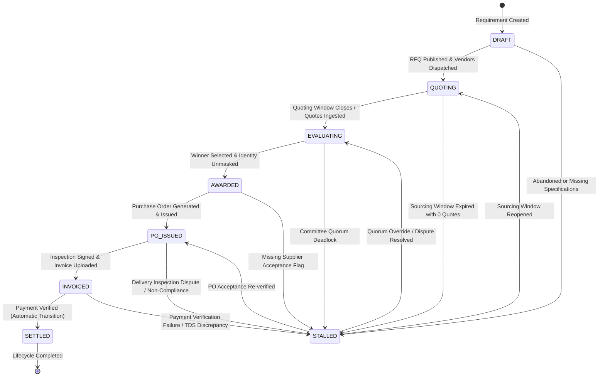

# 03. Domain Model, Indian Standards & State Machines

## 1. Domain Entities Architecture

The OTP Platform domain model is partitioned into distinct entity tiers enforcing clean architectural boundaries:

```
┌─────────────────────────────────────────────────────────────────────────────────────────┐
│                                   CORE ENTITIES                                         │
│                                                                                         │
│   ┌────────────────────────┐         1:N         ┌────────────────────────┐             │
│   │     Organization       │────────────────────▶│   OrganizationMember   │             │
│   │ (RWA, Enterprise, MSME)│                     │ (Owner, Manager, Buyer)│             │
│   └───────────┬────────────┘                     └───────────┬────────────┘             │
│               │                                              │                          │
│               │ 1:N                                          │ creates                  │
│               ▼                                              ▼                          │
│   ┌────────────────────────┐         1:1         ┌────────────────────────┐             │
│   │      Requirement       │────────────────────▶│          RFQ           │             │
│   │ (Indian Standards NLP) │                     │  (Sourcing Window)     │             │
│   └────────────────────────┘                     └───────────┬────────────┘             │
│                                                              │                          │
│                                ┌─────────────────────────────┼────────────────────────┐ │
│                                │ 1:N                         │ 1:N                    │ │
│                                ▼                             ▼                        ▼ │
│                   ┌─────────────────────────┐   ┌───────────────────────┐  ┌──────────┴┐│
│                   │      RFQInvitation      │   │     CommitteeVote     │  │   Award   ││
│                   │ (Supplier [Code] Alias) │   │ (Conflict Dec + Tally)│  │ (Decision)││
│                   └────────────┬────────────┘   └───────────────────────┘  └─────┬─────┘│
│                                │ 1:1                                             │ 1:1  │
│                                ▼                                                 ▼      │
│                   ┌─────────────────────────┐                       ┌────────────┴─────┐│
│                   │          Quote          │                       │  PurchaseOrder   ││
│                   │  (Sealed Commercials)   │                       │ (Legal Contract) ││
│                   └─────────────────────────┘                       └──────────────────┘│
└─────────────────────────────────────────────────────────────────────────────────────────┘
```

---

## 2. Indian Standards Taxonomy & Attribute Schemas

OTP natively integrates the **Bureau of Indian Standards (BIS)**, **FSSAI Quality Grades**, and **GST HSN/SAC Codes** into its parsing engine:

### 2.1 Standardized Measurement Units (`IndianStandardsUnits`)
- **Length & Area**: `running_meter`, `sq_ft`, `sq_meter`, `brass` (aggregate/earthwork).
- **Weight & Volume**: `kg`, `quintal` (100 kg), `metric_ton`, `liter`, `kiloliter`.
- **Commercial Counts**: `nos` (pieces), `pairs`, `sets`, `bundles`, `packets`, `lots`.
- **Engineering Capacities**: `hp` (motors), `kw` / `kva` (generators/transformers), `tr` (HVAC tons), `ah` (batteries).

### 2.2 Domain Category Specifications
The engine supports dynamic structured specification attributes for major procurement categories:
1. **Solar & Power Systems**: System capacity (kW), Panel efficiency (IS 14286), Inverter type (On-grid/Hybrid), Net-metering approval requirement.
2. **CCTV & Electronic Security**: Camera resolution (MP), NVR channels, Storage retention (BIS compliant 30/60/90 days), Cabling grade (Cat6/Fiber).
3. **Water Treatment & RO Plants**: Flow rate (LPH), Membrane type (Dow/Hydranautics), TDS reduction capacity, Raw water hardness tolerance.
4. **Gas Piping & Reticulation**: Pipe schedule (ASTM A53/IS 1239), Pressure testing certification (Hydrotest at 5x working pressure), Gas detector points.
5. **Furniture & Interior Fitouts**: Material grade (IS 303 MR/BWR Plywood, IS 2202 Flush doors), Edge banding thickness, Ergonomic certification (BIFMA).

---

## 3. Core State Machines & Transition Guards

Every domain lifecycle in OTP is governed by a **deterministic state machine** with transition guards implemented in TypeScript (`packages/domain`) and enforced by database triggers.

### 3.1 Requirement Lifecycle State Machine
Governs the intake and internal drafting of procurement requirements:

```
       ┌──────────┐
       │  DRAFT   │
       └────┬─────┘
            │ submit()
            ▼
       ┌──────────┐
       │SUBMITTED │
       └────┬─────┘
            │
      ┌─────┴─────────────────────────┐
      │ approve()                     │ cancel()
      ▼                               ▼
┌───────────┐                   ┌───────────┐
│ APPROVED  │                   │ CANCELLED │
└─────┬─────┘                   └───────────┘
      │ convertToRfq()
      ▼
┌───────────┐
│RFQ_CREATED│
└───────────┘
```

- **Invariants**:
  - A requirement cannot be approved if estimated value is missing.
  - A requirement in `RFQ_CREATED` cannot be cancelled; cancellation must occur at the RFQ level.

---

### 3.2 RFQ Phase Lifecycle State Machine
Governs the public sourcing window, quoting phase, evaluation, and award:

```
       ┌──────────┐
       │  INTAKE  │
       └────┬─────┘
            │ publishRfq() [Dispatches WhatsApp invites]
            ▼
       ┌──────────┐
       │ QUOTING  │◀─────────────────────────┐
       └────┬─────┘                          │
            │ closeQuotes() [Deadline reached]│ requestRevisions()
            ▼                                │
       ┌──────────┐                          │
       │EVALUATION│──────────────────────────┘
       └────┬─────┘
            │ awardWinner() [Justification gate passed]
            ▼
       ┌──────────┐
       │ AWARDED  │
       └────┬─────┘
            │ issuePurchaseOrder()
            ▼
       ┌──────────┐
       │FULFILLMENT│
       └──────────┘
```

- **Parallel Reveal State Machine (Bilateral Unmasking for GST Compliance)**:
  - `SEALED` (Default): Supplier business names, contacts, GSTIN, and attachments are strictly masked; Buyer organization details remain protected from non-awarded vendors.
  - `REVEALED`: Triggered atomically when an award is locked and PO is issued (`00156`). Identity unmasking is **bilateral and mutual**:
    - **Buyer $\rightarrow$ Supplier**: Reveals Buyer Organization Legal Entity, Buyer GSTIN (`tax_registration`), Billing & Delivery Site Address, and Authorized Contact Person, enabling the vendor to generate statutory GST Tax Invoices and pass Input Tax Credit (ITC) benefits under Section 16 of the CGST Act.
    - **Supplier $\rightarrow$ Buyer**: Reveals Supplier Business Name, Legal Name, Supplier GSTIN, Contact Email, and Phone.
    - **Platform Separation**: Reports generated by OTP serve as platform governance/audit summaries; POs and Invoices are direct bilateral commercial contracts between Buyer and Supplier. OTP does not act as buyer, seller, merchant of record, or payment custodian.

---

### 3.3 Quote Lifecycle State Machine
Governs individual supplier proposals submitted against an RFQ:

```
       ┌──────────┐
       │  DRAFT   │
       └────┬─────┘
            │ submitQuote() [Validates pricing, HSN, timeline]
            ▼
       ┌──────────┐
       │SUBMITTED │
       └────┬─────┘
            │ closeQuotes() [RFQ moves to EVALUATION]
            ▼
       ┌────────────┐
       │UNDER_REVIEW│
       └────┬───────┘
            │
      ┌─────┴─────────────────────────┐
      │ selectAsWinner()              │ rejectAsNotSelected()
      ▼                               ▼
┌───────────┐                   ┌─────────────┐
│ SELECTED  │                   │NOT_SELECTED │
└─────┬─────┘                   └─────────────┘
      │ signCommitment()
      ▼
┌───────────┐
│  AWARDED  │
└───────────┘
```

- **Invariants**:
  - Quotes cannot be edited or submitted once the RFQ quoting deadline expires.
  - A supplier cannot view quotes submitted by other suppliers.
  - Losing suppliers transition to `NOT_SELECTED` and receive automated outcome notices while remaining identity-protected.

---

## 4. The 8 Canonical Procurement Lifecycle States

### 4.0 Canonical High-Level Procurement Lifecycle

The high-level conceptual sequence across the entire OTP platform is:

**Requirement → Discovery → RFQ → Identity-Protected Evaluation → Market Intelligence → Committee Vote → Award → Reveal → PO → Work Order → Invoice → Payment → Performance → Audit**

- **Market Intelligence** is positioned as an explicit stage between *Identity-Protected Evaluation* and *Committee Vote* to deliver real-world cluster pricing benchmarks and supplier reliability indicators prior to committee voting.
- The lifecycle culminates in **Performance → Audit**, with *Audit* serving as the immutable post-settlement verification and compliance control stage.

### 4.1 Underlying State Machine States

The OTP Platform backend data models, telemetry, and operational troubleshooting suite map the workflow into **8 Core Procurement Lifecycle States**:



### 4.1 State Definitions & Transition Criteria

| State | Institutional Meaning | Transition Pre-Conditions | Exit Actions & Automations |
| :--- | :--- | :--- | :--- |
| **`DRAFT`** | Initial buyer drafting, NLP specification parsing, and document attachment. | Valid Indian Standards taxonomy, estimated budget, PIN-code location. | Triggers `publishRfq()`: generates cryptographic RFQ token and dispatches invites. |
| **`QUOTING`** | Live sourcing window; invited suppliers submit cryptographically sealed proposals. | RFQ published; quoting deadline active; identity protection enforced. | Closes quoting window; moves to comparison room; triggers quote normalization. |
| **`EVALUATING`** | Multi-factor comparison room; committee members vote on sealed scores. | Minimum 1 valid quote; conflict-of-interest declarations recorded. | Locks award justification; verifies quorum threshold; triggers one-way identity reveal. |
| **`AWARDED`** | Winning commercial proposal locked; buyer and winning vendor identities mutually unmasked. | Verified award justification; winning quote immutable. | Unmasks winning vendor GSTIN & contact; generates draft Purchase Order. |
| **`PO_ISSUED`** | Binding legal contract issued to winning supplier; manufacturing/service execution active. | PO signed by authorized procurement manager. | Supplier acknowledges PO; work order milestones created; delivery tracking activated. |
| **`INVOICED`** | Goods delivered / services rendered; formal commercial invoice uploaded with GST compliance. | Delivery inspection signed off; invoice GSTIN matching vendor record. | Enters settlement verification queue; verifies invoice line items vs PO amounts. |
| **`SETTLED`** | **Final Terminal State**: Payment verified against bank/UTR reference; contract fully closed. | Payment recorded and verified by finance/treasurer. | **Automatic transition upon payment verification**; immutable audit certificate minted. |
| **`STALLED`** | **Operational Exception State**: Process halted due to timeouts, quorum deadlock, or disputes. | Time limit exceeded (>24h inactivity), failed inspection, or explicit dispute raised. | Flagged in Admin Console Diagnostics; enables Super Admin Force-Advance or Revert tools. |

---

## 5. Advanced Domain Engines & ERP Integrations

### 5.1 Multi-Factor Supplier Performance Smart Scoring Engine
Implemented in `packages/domain/src/evaluation/smart-scoring.ts`:
- **Commercial Score (50% Weight)**: Inverse ratio based on L1 lowest price ($100 \times \frac{\text{Lowest Price}}{\text{Quote Price}}$).
- **Delivery Speed Score (20% Weight)**: Normalized against the fastest lead time ($100 \times \frac{\text{Fastest Days}}{\text{Quote Days}}$).
- **Warranty Score (15% Weight)**: Normalized against maximum warranty months ($100 \times \frac{\text{Quote Warranty}}{\text{Max Warranty}}$).
- **Quality & Technical Score (15% Weight)**: Based on verified catalog compliance and past inspection history.
- **GST Compliance Bonus (+5 Bonus Points)**: +5 point addition for active GSTIN verified suppliers.

### 5.2 Multi-Lingual Regional Procurement NLP Parser
Implemented in `packages/domain/src/parser/extractors.ts`:
- Native Unicode regex support (`u` flag) extracting quantity and units from Devnagari/Hindi text:
  - `लीटर` / `लीटरों` $\rightarrow$ `L` (Litres)
  - `किलो` / `किलोग्राम` $\rightarrow$ `KG` (Kilograms)
  - `मीटर` $\rightarrow$ `M` (Meters)
  - `टन` $\rightarrow$ `MT` (Metric Tons)
  - `नग` / `पीस` $\rightarrow$ `PCS` (Pieces)
- Example: *"5000 लीटर पानी का टैंकर"* auto-populates `{ quantity: 5000, unit: 'L' }`.

### 5.3 Open Standard ERP Exporters
Implemented in `packages/domain/src/accounting/`:
- **Tally Prime XML Exporter** (`tally-xml-exporter.ts`): Generates balanced double-entry `VOUCHER` XML (Purchase Order voucher type) with separate ledger allocations for base expense, CGST, SGST/IGST, and supplier payables.
- **Zoho Books JSON Exporter** (`zoho-json-exporter.ts`): Produces structured invoice payloads matching Zoho Books API schema with line item HSN codes, GST tax rates, and payment milestone terms.

