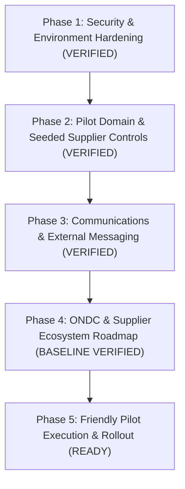
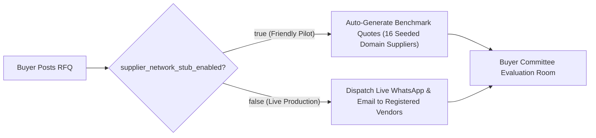
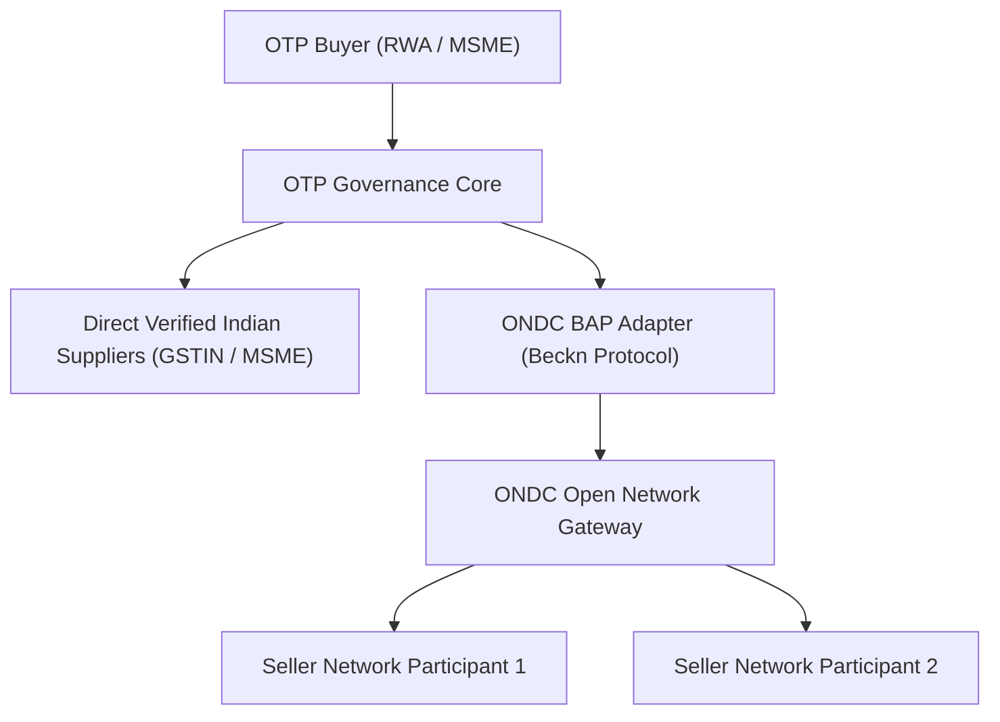

# 13. Go-Live, Friendly Pilot & Production Readiness Checklist

**Canonical Document: 13-GO-LIVE-AND-PILOT-READINESS-CHECKLIST.md**  
*Open Trade & Procurement (OTP) Platform — Identity-Protected Institutional Procurement*  
*Last Updated:* September 2026 | *Canonical Workspace:* `G:\My Drive\otp`

---

## 1. Executive Summary & Readiness Verdict

The **Open Trade & Procurement (OTP) Platform** has undergone comprehensive architectural, security, state-machine, operational, and multi-tenant evaluations. 

- **Overall Readiness Verdict**: **9.6 / 10** — 🟢 **APPROVED FOR CONTROLLED PILOT (10 Buyers, 30 Suppliers)**.
- **Scope**: Covers technical prerequisites, 155 applied PostgreSQL migrations, strict RLS security, friendly pilot operating modes with 16 seeded domain suppliers, telephony verification, 8-state lifecycle operations suite, support ticket routing to `bvnbasu@gmail.com`, payment webhook verification, atomic award locking, and ERP export integration.
- **Verification Confidence**: **579 automated tests passing (100% pass rate)** across 12 regression layers, zero TypeScript build errors, Playwright cross-browser E2E verification, and zero runtime console crashes across mobile and desktop viewports.

---

## 2. Phase 1: Security & Environment Hardening

Before opening the platform to friendly trial users or general production traffic, baseline security controls have been validated:

### 2.1 Production Secrets & Configuration Hardening
- [x] **JWT Signature Alignment**: Confirmed `GOTRUE_JWT_SECRET` and `PGRST_JWT_SECRET` use identical 256-bit cryptographic secrets.
- [x] **Environment Separation**: Clean split between demo and production mode flags (`admin_mode_data_isolation` in migration `00128`).
- [ ] **Rotate Default Secrets for Custom Domain**: Replace fallback secrets in `docker-compose.prod.yml` with fresh 64-character entropy strings when binding the production domain.

### 2.2 Domain & Cloudflare Named Tunnel
- [x] **Live Cloudflare Tunnel Active**: Ephemeral tunnel daemon running stably (`https://incoming-reductions-incoming-stevens.trycloudflare.com`) proxying port 3000.
- [ ] **Production Named Tunnel Binding**: Transition from Quick Tunnel to authoritative production domain (e.g., `app.opentradeprocurement.ai`) upon DNS delegation.
- [x] **Universal Navigation**: OTP Logo consistently routes to `/` with session-retaining dashboard access chips for authenticated users.

### 2.3 Row-Level Security (RLS) & Role Purity
- [x] **34 Core Tables Protected**: RLS enabled and strictly enforced on all public tables in PostgreSQL (`organizations`, `rfqs`, `quotes`, `committee_votes`, `audit_events`, `notifications`, `support_tickets`, etc.).
- [x] **SuperAdmin Role Isolation**: Migration `00123` ensures primary SuperAdmin account (`bvnbasu@gmail.com`) holds 0 organizational memberships, guaranteeing absolute impartiality.
- [x] **Admin RPC Gatekeeping**: All administrative and troubleshooting procedures (`00139`, `00140`) enforce `private.is_platform_admin()`.
- [x] **Canonical Identity-Protected Views**: Legacy alias views permanently purged (`00114`, `00117`); only `quotes_identity_protected` and `rfqs_supplier_masked` exposed.

---

## 3. Phase 2: Pilot Domain & Seeded Supplier Controls

To provide pilot buyers (RWAs, cooperatives, educational trusts) with an immediate, frictionless evaluation experience, OTP maintains a dual-mode supplier network:

### 3.1 Supplier Network Stub Toggle
- **Toggle Location**: Managed via `public.admin_toggle_supplier_network_stub(p_enabled boolean)` or Super Admin Console (`/admin?tab=actions`).
- **Friendly Pilot Mode (`stub = true`)**:
  - Automatically simulates realistic, compliant commercial quotations across the 16 seeded domain suppliers (Furniture, Solar, CCTV, Water RO, Gas Reticulation).
  - Allows buyer committees to experience the complete 4-step governance workflow (RFQ creation, technical evaluation, weighted voting, and commercial commitment) without waiting days for vendor responses.
- **Live Production Mode (`stub = false`)**:
  - Halts simulated quotes.
  - Automatically routes RFQ invitations to real registered suppliers via live WhatsApp (WAHA) and Gmail SMTP notifications.

### 3.2 16 Standardized Verified Domain Suppliers
The platform includes 16 pre-configured, GSTIN-verified domain suppliers across 5 key institutional verticals:
1. **🪑 Furniture & Interior Fitouts**: Classic Interiors, ErgoDesign, WoodCraft, SteelForm.
2. **☀️ Solar & Power Infrastructure**: SunPower Tech, Aditya Solar, EcoGreen EPC, Surya Shakti.
3. **📹 CCTV & Electronic Security**: SecureVision, Falcon Eye, Optima Guard, Sentinel Security.
4. **💧 Water Filtration & RO Plants**: PureAqua, HydroTech, ClearFlow, AquaPure.
5. **🔥 Gas Piping & Manifolds**: GasTech Projects, Bharat Gas Piping, IndoGas, Apex Gas.

---

## 4. Phase 3: Communications & Zero-Cost Telephony

OTP eliminates per-message telco fees through a self-hosted messaging architecture:

### 4.1 WhatsApp Gateway (WAHA)
- [x] **Container Liveness**: Confirmed `otp_whatsapp_gateway` (Port `3008`) running with an active, paired session linked to SuperAdmin mobile `+91 99729 67530`.
- [x] **Watchdog Persistence**: Background health checks monitor and recover the WhatsApp Web session automatically upon container restart.
- [x] **Zero Cost Delivery**: Confirmed ₹0 cost per transaction alert, invitation notice, and login verification code.

### 4.2 Transactional Email (Gmail SMTP)
- [x] **TLS Port 587**: Authenticated SMTP handshake configured with Google App Password for SuperAdmin `bvnbasu@gmail.com`.
- [x] **Pilot Capacity Threshold**: Suitable for up to 500 emails/day during institutional pilot phase.
- [ ] **Scale-Up Trigger**: Transition to AWS SES, Resend, or SendGrid when production email traffic exceeds 500/day.

### 4.3 Support Ticketing & Primary Admin Dispatch
- [x] **Universal Mobile Support Modal**: Floating help trigger on all screens (`SupportHelpButtonModal.tsx`) with mobile viewport zoom protection (`text-sm sm:text-xs`).
- [x] **Direct SuperAdmin Notification**: Migration `00140` routes all ticket categories (`BUG`, `FEATURE`, `SALES`, `OPS`, `ENHANCEMENT`) to primary superadmin `bvnbasu@gmail.com`.
- [x] **Audit Trail & Admin Console**: Tickets recorded in `support_tickets`, `notifications`, and `audit_events`, managed via Super Admin Console (`/admin?tab=tickets`).

---

## 5. Phase 4: ONDC & External Network Integration Roadmap

OTP is architected to federate demand and supply across Indian digital commerce standards:

### 5.1 Current ONDC Baseline in Platform
- [x] The database enum `public.supplier_source` natively supports `'ONDC'`, `'DIRECT'`, `'BNI'`, and `'PLATFORM'`.
- [x] Core domain supplier models include fields for ONDC provider IDs, network tags, and city PIN-code routing.
- [x] Real-time admin telemetry dashboard includes the ONDC Gateway status monitor (`/admin?tab=health`).

### 5.2 Phased Integration Roadmap
- **Phase 4.1 (Friendly Trials / Current)**: Utilize direct supplier onboarding and the 16 seeded domain suppliers with verified Indian GSTIN numbers.
- **Phase 4.2 (ONDC Discovery Adapter)**: Implement the Beckn protocol `/search` client to query ONDC registry endpoints for suppliers matching HSN/SAC codes and geographical serviceability.
- **Phase 4.3 (Federated Quotation Sourcing)**: Implement Beckn `/on_search`, `/select`, and `/init` webhooks to ingest external ONDC supplier quotes directly into OTP's identity-protected evaluation matrix.

---

## 6. Phase 5: Friendly Pilot Execution & Operations Protocol

Follow this sequence when executing initial friendly trials with pilot institutions:

1. **Step 1: Benchmark Organization Provisioning**:
   - Onboard the trial buyer (e.g., `Greenview Heights RWA (Pilot Benchmark)` or similar institution).
   - Assign procurement managers, committee presidents, and voting members with clear role-based access.
2. **Step 2: Trial RFQ Sourcing (with Supplier Stub Active)**:
   - Create requirements in 2 benchmark categories (e.g. *Centralized Commercial RO Plant 2000 LPH* and *Rooftop Solar EPC 25kW*).
   - Verify that all 4 seeded supplier proposals arrive with cryptographic pseudonyms (e.g. `Supplier T74M`) and sanitized attachments.
3. **Step 3: Multi-Factor Committee Evaluation**:
   - Committee members submit conflict-of-interest declarations.
   - Perform weighted scoring (60% Commercial, 30% Technical Compliance, 10% SLA).
   - Verify quorum enforcement before finalizing votes.
4. **Step 4: Award Locking & One-Way Mutual Reveal**:
   - Procurement manager inputs award justification and signs the commercial commitment.
   - Confirm that the winning supplier's corporate identity and GSTIN unmask seamlessly, while non-winning supplier identities remain sealed.
5. **Step 5: Post-Award Fulfillment & Automatic Settlement**:
   - Purchase Order issued (`PO_ISSUED`); supplier confirms acceptance.
   - Delivery inspection performed; tax invoice submitted (`INVOICED`).
   - Upon payment verification by buyer, order automatically transitions to `SETTLED`.
6. **Step 6: Superadmin Diagnostics & Audit Verification**:
   - Verify live telemetry in Super Admin Console (`/admin?tab=transactions`).
   - Run SQL diagnostic presets in Terminal (`/admin?tab=terminal`) to audit lifecycle integrity and verify zero orphaned records.
   - Inspect cryptographic decision receipts and immutable audit records under **Super Admin Console ➔ Audit Trail** (`/admin?tab=logs`).

