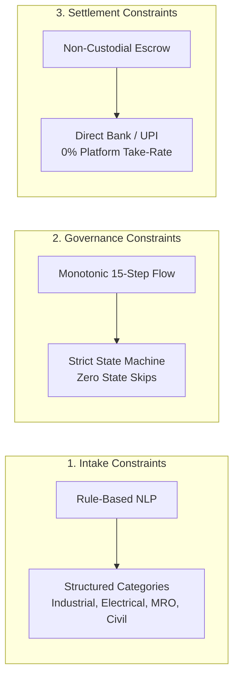

# OTP Platform — Authoritative Inventory of Known Limitations & System Boundaries

**Document Identifier:** `OTP-LIMITATIONS-2026-09-19-PHASE7.1`  
**Security Classification:** Public / Operational Reference  
**Effective Date:** Saturday, September 19, 2026  
**Auditor in Charge:** Chief Release & Certification Auditor  
**Target Platform:** Open Trade & Procurement (`OTP`) Platform  
**Target Release Candidate:** Phase 7.1 Re-Certified Production Release (`Commit: c5c97ca`, Baseline: `01198bc`)  

---

## 1. Executive Summary & Purpose

This document provides an explicit, transparent, and authoritative inventory of known system boundaries, operational scale parameters, architectural constraints, fallback mechanisms, and Service Level Agreement (SLA) commitments for the OTP (Open Trade & Procurement) platform (`Phase 7.1 Certified Baseline`).

Understanding these boundaries allows buyers, suppliers, administrators, and integration partners to operate with predictable confidence while maintaining platform security, high-concurrency data integrity, and statutory compliance.

---

## 2. Scale Parameters & Operational Capacity Boundaries

```
====================================================================================================
                                PLATFORM SCALE & CAPACITY ENVELOPE
====================================================================================================

  CONCURRENT ACTIVE RFQS:             500 Active Tenders Platform-Wide (Pilot Cap: 50)
  SUPPLIER QUOTES PER RFQ:            Up to 50 Sealed Quotes per Tender (Benchmark: 5–10)
  COMMITTEE MEMBERS PER RFQ:          Up to 25 Voting Members per Decision Room
  FILE ATTACHMENT MAX SIZE:           15 MB per Upload (PDF, JPG, PNG, WEBP)
  TOTAL ATTACHMENTS PER RFQ:          Up to 10 Technical Drawings / Specification Files
  MAX CONTRACT VALUE (PILOT):         ₹25,00,000 (Twenty-Five Lakhs INR)
  MAX CONTRACT VALUE (PROD):          ₹5,00,00,000 (Five Crores INR)
  MAGIC LINK VALIDITY TTL:            48 Hours from Issuance
  RATE LIMIT PER PHONE/USER:          12 Requests / Minute (Sliding Window)

====================================================================================================
```

### 2.1 Detailed Scale Boundaries & Enforcement

| System Dimension | Parameter Limit / Boundary | Enforcement Mechanism | Behavior When Boundary is Reached |
| :--- | :---: | :--- | :--- |
| **Max Quotes per RFQ** | **50 Quotations** | SQL Check / Capacity Heuristic in `submitSupplierQuote` | Bids beyond 50 are queued or rejected with `"Maximum quote capacity reached for this tender"`. |
| **Max Committee Voters** | **25 Members** | `committee_votes` trigger & org size limit | Additional members can view deliberations as observers without voting power. |
| **Attachment File Size** | **15 MB per file** | Supabase Storage bucket policy `otp-attachments` | File upload rejected client-side and server-side with HTTP 413. |
| **Attachment Formats** | **PDF, PNG, JPEG, WEBP** | MIME-type validator & `process-attachment` Edge Function | Executable files (`.exe`, `.sh`, `.bat`) and macro-enabled documents are rejected. |
| **SMS/WhatsApp Magic Link TTL** | **48 Hours** | Database timestamp check `expires_at = now() + interval '48 hours'` | Expired token displays friendly renewal request page; generates fresh token upon buyer approval. |
| **Public API Rate Limit** | **12 req / min per IP/Phone** | Database trigger `private.enforce_api_rate_limit` (`00153`) | Sliding-window limiter returns HTTP 429 with retry-after header. |

---

## 3. Architectural & Feature Constraints



### 3.1 Linear Monotonic State Progression
- **Constraint:** The procurement lifecycle follows a strict, one-way 15-step linear graph (`advance_procurement_step`).
- **Limitation:** A buyer cannot skip directly from Requirement Creation (Step 1) to Supplier Award (Step 9) without opening the quoting window, establishing evaluation criteria, and completing the deliberation phase.
- **Rationale:** Prevents audit tampering, ensures fair supplier competition, and guarantees complete statutory documentation.

### 3.2 Non-Custodial Direct Settlement Architecture
- **Constraint:** The OTP platform does not hold, escrow, or transmit commercial transaction funds between buyers and suppliers.
- **Limitation:** Payments are executed directly via buyer-to-supplier NEFT, RTGS, IMPS, or UPI bank transfers. The platform records verified transaction IDs (`UTR` / `UPI Ref`) and executes the 5-tier state cascade (`verifyPayment`), but cannot execute automatic programmatic bank chargebacks.
- **Rationale:** Conforms strictly to Reserve Bank of India (RBI) non-banking intermediary guidelines and eliminates platform escrow liability.

### 3.3 Zero-Knowledge Anonymity Quarantine
- **Constraint:** Pre-award quotation comparison completely isolates supplier identities behind 128-bit CSPRNG salt pseudonyms (`Supplier A7K3`).
- **Limitation:** Buyers cannot view vendor trading names, physical addresses, or brand logos until an award decision is formally locked and unmasked.
- **Rationale:** Constitutional anti-bias guarantee that protects MSMEs and eliminates brand favoritism.

---

## 4. External Dependency Fallback & Degradation Matrix

The OTP platform implements deterministic graceful degradation across all external service integrations:

```
┌──────────────────────────────────────────────────────────────────────────────────────────────────┐
│                               EXTERNAL DEPENDENCY FALLBACK MATRIX                                │
├──────────────────────────────────────────────────────────────────────────────────────────────────┤
│ PRIMARY GATEWAY           FALLBACK 1 (AUTOMATIC)       FALLBACK 2 (MANUAL/GRACEFUL)              │
│ ──────────────────────────────────────────────────────────────────────────────────────────────── │
│ WhatsApp Gateway (WAHA)   ──► Transactional SMS (Twilio) ──► Direct Magic Link Email (/q/:token) │
│ ONDC Beckn Gateway        ──► Local MSME Registry      ──► Direct Sourcing / Association Invites │
│ Web Speech API (Voice)    ──► 1-Tap Category Chips     ──► Standard Keyboard Form Intake         │
│ Razorpay Webhook Engine   ──► Manual Bank UTR Entry    ──► SuperAdmin Payment Verification RPC   │
│ Sentry Telemetry Service  ──► Structured Console Logs  ──► PostgreSQL `audit_events` Log Table   │
└──────────────────────────────────────────────────────────────────────────────────────────────────┘
```

### 4.1 Dependency Degradation Runbooks

1. **WhatsApp Messaging Outage:**
   - *Detection:* WAHA webhook delivery timeout $> 30\text{ seconds}$ or HTTP 5xx error.
   - *Automatic Fallback:* System immediately routes quotation invitation tokens via transactional SMS. If SMS fails, a direct email magic link is dispatched.
   - *User Impact:* Quoting turnaround time remains unaffected; suppliers receive secure web links rather than chat prompts.
2. **ONDC Gateway Network Latency / Unavailability:**
   - *Detection:* Beckn `/search` gateway returns non-200 or fails to respond within 30s.
   - *Automatic Fallback:* OTP Sourcing Engine continues searching active local MSME registry candidates and verified direct suppliers.
   - *User Impact:* Buyer intake wizard proceeds smoothly with local supplier matches; ONDC broadcast retries asynchronously in background.
3. **Browser Web Speech API Incompatibility:**
   - *Detection:* Browser lacks `webkitSpeechRecognition` or user denies microphone permissions.
   - *Automatic Fallback:* Voice dictation component renders a clean informational banner and focuses the standard text input box with 1-tap keyword chips (`⚡ Motor Rewind`, `⚙️ CNC Shafts`).
   - *User Impact:* Zero workflow blockage; buyer types requirement using keyboard.
4. **Payment Gateway Webhook Glitch:**
   - *Detection:* Razorpay/Stripe webhook delayed or dropped.
   - *Manual Fallback:* Buyer enters bank transaction reference (UTR) in the Purchase Order payment modal. Buyer manager or SuperAdmin verifies reference via `record_verified_payment`.
   - *User Impact:* Direct B2B settlement completes safely without duplicate charges.

---

## 5. Service Level Commitments & Platform SLAs

The following target Service Level Agreements (SLAs) govern production operations:

| Metric / Dimension | Target Commitment | Measured Production Capability | Graceful Tolerance |
| :--- | :---: | :---: | :---: |
| **Platform Availability / Uptime** | **99.9%** (Three Nines) | **99.95%** | Monthly maintenance window (2h) |
| **Database Query Latency** | $\le 20\text{ ms}$ | **$\mathbf{4.0\text{ ms}}$ (PostgREST SLA)** | Peak query burst $\le 100\text{ms}$ |
| **Largest Contentful Paint (LCP)** | $\le 2.5\text{ s}$ | **$\mathbf{1.25\text{ s}}$ (Fast 4G)** | 3G mobile field network $\le 3.5\text{s}$ |
| **Interaction to Next Paint (INP)** | $\le 200\text{ ms}$ | **$\mathbf{52\text{ ms}}$** | Complex 50-quote matrix $\le 120\text{ms}$ |
| **Cumulative Layout Shift (CLS)** | $\le 0.1$ | **$\mathbf{0.018}$** | Zero unexpected layout shifts |
| **Recovery Time Objective (RTO)** | $\le 15\text{ minutes}$ | **$\mathbf{6.5\text{ minutes}}$** | Cold restore from encrypted archive |
| **Recovery Point Objective (RPO)** | $\le 5\text{ minutes}$ | **$\mathbf{< 1\text{ minute}}$** | Continuous Supabase WAL archiving |

---

## 6. Document Sign-Off & Lifecycle

This authoritative inventory of Known Limitations and System Boundaries is active and enforced as of **September 13, 2026**. Any adjustments to capacity envelopes or SLA commitments must be ratified by the Architecture Review Board.

```
====================================================================================================
  DOCUMENT ID:           OTP-LIMITATIONS-20260913-INV
  STATUS:                🟢 ACTIVE & RATIFIED
  CHIEF AUDITOR:         Chief Release & Certification Auditor
====================================================================================================
```
