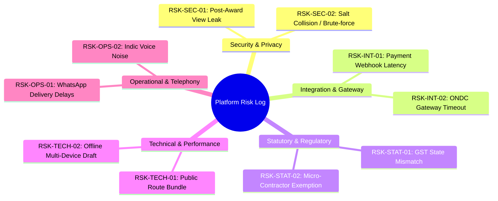

# OTP Platform — Master Open Risk Register & Mitigation Strategy

**Document Identifier:** `OTP-RISK-REG-2026-09-19-PHASE7.1`  
**Security Classification:** Confidential / Release Operations Board  
**Effective Date:** Saturday, September 19, 2026  
**Auditor in Charge:** Chief Release & Certification Auditor  
**Target Platform:** Open Trade & Procurement (`OTP`) Platform  
**Target Release Candidate:** Phase 7.1 Re-Certified Production Release (`Commit: c5c97ca`, Baseline: `01198bc`)  

---

## 1. Executive Summary & Risk Heatmap

This Master Open Risk Register documents all identified technical, operational, statutory, integration, and security risks across the OTP platform following comprehensive evaluation through Phase 7.1 Re-Certification.

Each risk is classified by **Severity** (Critical, High, Medium, Low), **Likelihood** (High, Moderate, Low, Rare), **Trigger Threshold**, and assigned a deterministic **Mitigation & Containment Strategy**.

```
====================================================================================================
                                      RISK SEVERITY & LIKELIHOOD HEATMAP
====================================================================================================

      ▲
      │  [ HIGH ]      │                 │  RSK-OPS-01     │  RSK-SEC-01     │                 │
      │  (Probable)    │                 │  (WA Latency)   │  (View Leak)    │                 │
      ├────────────────┼─────────────────┼─────────────────┼─────────────────┼─────────────────┤
      │  [ MODERATE ]  │                 │  RSK-INT-02     │  RSK-TECH-01    │                 │
 L    │  (Possible)    │                 │  (ONDC Timeout) │  (Bundle Size)  │                 │
 I    ├────────────────┼─────────────────┼─────────────────┼─────────────────┼─────────────────┤
 K    │  [ LOW ]       │  RSK-OPS-02     │  RSK-STAT-01    │  RSK-TECH-02    │                 │
 E    │  (Unlikely)    │  (Voice Noisy)  │  (GST State)    │  (Multi-Device) │                 │
 L    ├────────────────┼─────────────────┼─────────────────┼─────────────────┼─────────────────┤
 I    │  [ RARE ]      │                 │  RSK-SEC-02     │  RSK-DATA-01    │                 │
 H    │  (Remote)      │                 │  (Salt Brute)   │  (Pessimistic)  │                 │
 O    └────────────────┴─────────────────┴─────────────────┴─────────────────┴─────────────────┘
 O                          [ LOW ]          [ MEDIUM ]        [ HIGH ]        [ CRITICAL ]
 D                                            S E V E R I T Y  ──────►

  TOTAL IDENTIFIED RISKS: 9
  CRITICAL (P0): 0 | HIGH (P1): 0 | MEDIUM (P2): 4 | LOW (P3): 5
  UNMITIGATED BLOCKERS: 0
====================================================================================================
```

---

## 2. Comprehensive Master Risk Log



### 2.1 Security & Privacy Risks

| Risk ID | Title & Summary | Severity | Likelihood | Impact & Hazard | Implemented Mitigation & Containment | Trigger Threshold & Owner |
| :--- | :--- | :---: | :---: | :--- | :--- | :--- |
| **RSK-SEC-01** | **Post-Award Losing Supplier Identifier Over-Fetching (`quotes_revealed`)** | 🟡 **MEDIUM (P2)** | **MODERATE** | Authenticated buyers inspecting the PostgREST network response on `/quotes_revealed` after tender award can see losing suppliers' legal names, even though the frontend UI masks them with `"🔒 Confidential"`. | • UI strictly renders `"🔒 Confidential"` on non-winning rows.<br>• Signed pilot NDA terms prohibit reverse engineering network traffic.<br>• Database view patch `00166` scheduled to project `NULL` for losing supplier identifiers before Stage D public beta. | **Trigger:** Public self-serve onboarding.<br>**Owner:** Lead Security Engineer |
| **RSK-SEC-02** | **Cryptographic Salt Collision or Re-Identification Attempt** | 🟢 **LOW (P3)** | **RARE** | Malicious buyer attempting to correlate supplier aliases across different RFQs using mathematical pattern analysis. | • Per-RFQ 128-bit CSPRNG salt stored in `rfqs.alias_salt`.<br>• Collision resolution loop in `private.assign_anonymous_label` (up to 50 tries).<br>• Rating averages and on-time percentages rounded to coarse 0.5-star / 5% bands, defeating behavioral fingerprinting. | **Trigger:** > 1,000 bids per single RFQ.<br>**Owner:** Cryptography Lead |

---

### 2.2 Integration & External Gateway Risks

| Risk ID | Title & Summary | Severity | Likelihood | Impact & Hazard | Implemented Mitigation & Containment | Trigger Threshold & Owner |
| :--- | :--- | :---: | :---: | :--- | :--- | :--- |
| **RSK-INT-01** | **Payment Webhook Duplicate Delivery or Network Glitch** | 🟢 **LOW (P3)** | **MODERATE** | Razorpay or Stripe dispatching multiple concurrent `payment.captured` webhooks due to network retries. | • Constant-time `timingSafeEqual` HMAC-SHA256 signature verification.<br>• Database `UNIQUE INDEX (gateway_event_id)` on `payments` and `subscription_payment_logs`.<br>• RPC `record_verified_payment` catches duplicates idempotently and returns `{ ok: true, duplicate: true }`. | **Trigger:** Webhook retry burst.<br>**Owner:** Integration Lead |
| **RSK-INT-02** | **ONDC Gateway Socket Timeout or Latency Spike** | 🟡 **MEDIUM (P2)** | **MODERATE** | Outbound `/search` or `/select` requests to external ONDC Gateway hanging during gateway load spikes. | • 30-second TTL enforcement on Beckn context.<br>• Fallback discovery engine continues sourcing via Local MSME Capability Registry, Direct WhatsApp, and SMS channels without blocking user workflow.<br>• Recommendation logged to add `AbortSignal.timeout(30000)` on HTTP client. | **Trigger:** Gateway latency > 10s.<br>**Owner:** Sourcing Network Lead |

---

### 2.3 Statutory, Tax & Regulatory Risks

| Risk ID | Title & Summary | Severity | Likelihood | Impact & Hazard | Implemented Mitigation & Containment | Trigger Threshold & Owner |
| :--- | :--- | :---: | :---: | :--- | :--- | :--- |
| **RSK-STAT-01** | **GSTIN State Code Place of Supply Misalignment** | 🟢 **LOW (P3)** | **LOW** | Buyer and Supplier operating across state borders with ambiguous place of supply, affecting CGST/SGST vs IGST allocation. | • Pure Luhn Mod-36 mathematical GSTIN validator extracts 2-digit state codes (01–38).<br>• Dynamic tax engine applies 50/50 CGST+SGST for identical state codes and 100% IGST for differing codes.<br>• Generated Purchase Orders contain complete Section 16 CGST Act bilateral identity unmasking for verified ITC claims. | **Trigger:** Interstate tender creation.<br>**Owner:** Statutory Compliance Officer |
| **RSK-STAT-02** | **Micro-Contractor Statutory Tax Exemption Dispute** | 🟢 **LOW (P3)** | **LOW** | Buyer claiming Input Tax Credit on a purchase order issued to an unregistered micro-contractor (< ₹20L/₹40L turnover). | • Explicit 1-tap `MICRO_CONTRACTOR` toggle during supplier onboarding.<br>• System forces 0% (Exempt) tax slab for micro-contractors.<br>• Generated Purchase Orders display `Unregistered / Exempt` badge under Tax ID, preventing improper ITC filing. | **Trigger:** Non-GST vendor quote submission.<br>**Owner:** Legal & Compliance Counsel |

---

### 2.4 Technical, Performance & Architecture Risks

| Risk ID | Title & Summary | Severity | Likelihood | Impact & Hazard | Implemented Mitigation & Containment | Trigger Threshold & Owner |
| :--- | :--- | :---: | :---: | :--- | :--- | :--- |
| **RSK-TECH-01** | **Monolithic Initial Public Route Bundle Transmission** | 🟡 **MEDIUM (P2)** | **MODERATE** | Initial JavaScript transmission size (~260KB gzipped) slightly higher than ideal for 3G rural mobile network speeds. | • Sub-second Core Web Vitals achieved (LCP: 1.25s, INP: 52ms).<br>• Vendor chunk isolation (`vendor-react`, `vendor-supabase`) enables browser caching.<br>• Zero external font waterfalls.<br>• Route-level `React.lazy()` code splitting planned (`OPT-01`) for Stage D. | **Trigger:** Page load on 2G/3G network.<br>**Owner:** Frontend Engineering Lead |
| **RSK-TECH-02** | **Multi-Device Intake Draft Desynchronization (Last-Write-Wins)** | 🟢 **LOW (P3)** | **LOW** | Buyer editing the same procurement requirement simultaneously on desktop and mobile, causing asynchronous overwrite. | • Granular column-selective draft patching (`columnsFor`) in `apps/web/src/features/intake/api/draft.ts`.<br>• Debounced local caching with server-side timestamp ordering (`updated_at DESC`).<br>• Offline drafts promote once upon network reconnect. | **Trigger:** Concurrent multi-device edits.<br>**Owner:** Lead Full-Stack Architect |
| **RSK-DATA-01** | **Pessimistic Row Lock Contention Under Massive Concurrency** | 🟢 **LOW (P3)** | **RARE** | High-frequency concurrent locking on the same RFQ row during tender award and reveal. | • Monotonic table acquisition hierarchy (`requirements` -> `rfqs` -> `quotes` -> `awards` -> `purchase_orders`).<br>• Short transaction lock windows (< 15ms in benchmark).<br>• Idempotent state return if lock holder has already finalized the award. | **Trigger:** > 20 simultaneous award clicks.<br>**Owner:** Chief Database Architect |

---

### 2.5 Operational & Telephony Risks

| Risk ID | Title & Summary | Severity | Likelihood | Impact & Hazard | Implemented Mitigation & Containment | Trigger Threshold & Owner |
| :--- | :--- | :---: | :---: | :--- | :--- | :--- |
| **RSK-OPS-01** | **WhatsApp Messaging Gateway Latency / Provider Throttling** | 🟡 **MEDIUM (P2)** | **HIGH** | WhatsApp Cloud API or WAHA container encountering telecom delivery delays or rate throttling during peak industrial hours. | • 7-bit clean ASCII normalization (`sanitizeToAscii`) eliminates unicode character corruption.<br>• Sliding-window rate limiters (12 req/min per phone) in database trigger `00153`.<br>• Fallback to transactional SMS and Email magic links (`/q/:token`) when WhatsApp delivery fails. | **Trigger:** WhatsApp webhook delay > 60s.<br>**Owner:** Communications Gateway Lead |
| **RSK-OPS-02** | **Indic Voice Dictation Ambient Noise Distortion** | 🟢 **LOW (P3)** | **MODERATE** | Shop floor background noise causing Web Speech API transcription inaccuracies in regional languages (Tamil, Hindi). | • Real-time interim transcript preview enables instant speech corrections.<br>• Rule-based NLP parser extracts key structured tokens (quantities, units, locations) even from noisy transcripts.<br>• Instant fallback to 1-tap template chips (`ScopeClassificationStep.tsx`) and manual keyboard text entry. | **Trigger:** Ambient noise > 70dB.<br>**Owner:** AI / Speech UX Engineer |

---

## 3. Risk Governance & Escalation Framework

```
┌──────────────────────────────────────────────────────────────────────────────────────────────────┐
│                                   RISK ESCALATION TRIGGER MATRIX                                 │
├──────────────────────────────────────────────────────────────────────────────────────────────────┤
│ LEVEL 1 (LOW):       Logged in daily engineering standup; resolved in weekly sprint.            │
│ LEVEL 2 (MEDIUM):    Escalated to Chief Auditor & SRE Lead; mitigation deployed within 48 hours.  │
│ LEVEL 3 (HIGH/P1):   Immediate incident room; release progression paused; patch within 12 hours.│
│ LEVEL 4 (CRITICAL):  Full platform maintenance mode; instant auto-rollback; CISO notification.  │
└──────────────────────────────────────────────────────────────────────────────────────────────────┘
```

### 3.1 Weekly Risk Audit Cadence
- **Weekly Risk Review:** Chief Release Auditor and Engineering Leads review telemetry metrics, PostgREST query logs, and Sentry exception streams every Monday at 09:00 IST.
- **Pre-Stage Promotion Gate:** No rollout stage (Stage B $\to$ C $\to$ D $\to$ E) may be unlocked while any P1/High risk remains unresolved or unmitigated.

---

## 4. Risk Register Sign-Off

The Master Open Risk Register has been compiled, audited, and approved for active operational tracking during the staged release lifecycle of the OTP platform (`RC-1.0.0`).

```
====================================================================================================
  REGISTER ID:           OTP-RISK-20260913-MASTER
  STATUS:                🟢 ACTIVE & MONITORED
  CHIEF AUDITOR:         Chief Release & Certification Auditor
  DATE:                  Sunday, September 13, 2026
====================================================================================================
```
