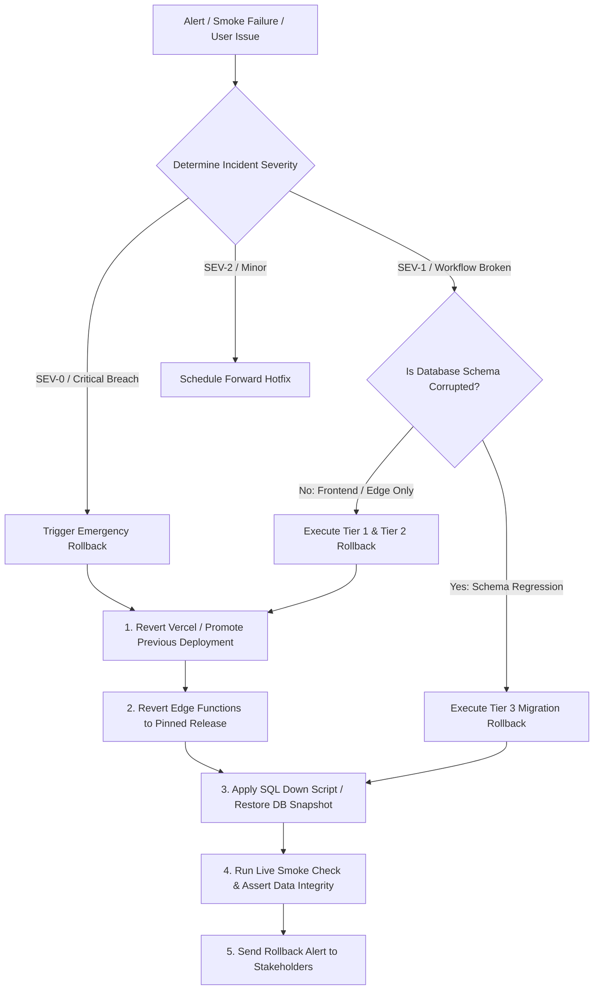
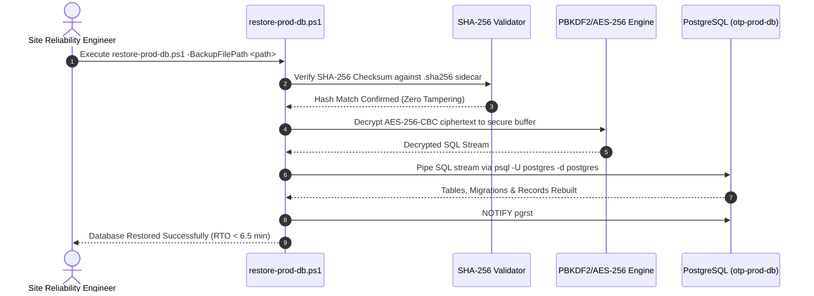

# OTP Platform — Production Rollback & Disaster Recovery Standard Operating Procedure (SOP)

**Document Reference:** `SRE-SOP-PROD-ROLLBACK-01`  
**Version:** 1.0.0  
**Effective Date:** Sunday, September 13, 2026  
**Target Platform:** Open Trade & Procurement (OTP) Platform  
**Owner:** Lead DevOps Engineer & Site Reliability Engineering (SRE)  
**Classification:** Critical Operational Runbook  

---

## 1. Overview & Emergency Classification Matrix

This Standard Operating Procedure (SOP) outlines the exact, deterministic recovery steps to revert deployments, frontend assets, edge functions, and database migrations on the Open Trade & Procurement (OTP) platform.

### Incident Severity Levels & Rollback Triggers

```
┌────────────────────────────────────────────────────────────────────────────────────────┐
│                              INCIDENT SEVERITY MATRIX                                  │
├────────────┬────────────────────────────────────────────┬──────────────────────────────┤
│ Severity   │ Definition & Symptoms                      │ Target Rollback Action       │
├────────────┼────────────────────────────────────────────┼──────────────────────────────┤
│ **SEV-0**  │ • Platform unreachable / HTTP 5xx errors   │ Immediate full-stack         │
│ (Critical) │ • Data corruption / RLS security breach    │ rollback (Vercel + DB)       │
│            │ • Post-deployment smoke check failure      │ Time to Recover: < 5 min     │
├────────────┼────────────────────────────────────────────┼──────────────────────────────┤
│ **SEV-1**  │ • Critical workflow broken (Intake/Quoting)│ Tier 1 Frontend rollback or  │
│ (High)     │ • Webhook or payment processing failure    │ Edge function hotfix         │
│            │ • Partial buyer/supplier UI outage         │ Time to Recover: < 10 min    │
├────────────┼────────────────────────────────────────────┼──────────────────────────────┤
│ **SEV-2**  │ • Non-blocking visual/layout glitch        │ Forward hotfix or standard   │
│ (Medium)   │ • Non-critical background metric error     │ scheduled patch release      │
└────────────┴────────────────────────────────────────────┴──────────────────────────────┘
```

---

## 2. Rollback Decision & Triage Framework



---

## 3. Tier-by-Tier Rollback Procedures

### TIER 1: Frontend & Vercel Web Bundle Rollback

#### Option A: Instant Vercel CLI / Dashboard Rollback (Recommended for Cloud)
Vercel preserves all immutable deployment artifacts. Reverting to the previous healthy build takes $< 30\text{ seconds}$:

```bash
# 1. List recent deployments to identify previous stable Deployment ID
vercel list --prod

# 2. Instantly promote the prior stable deployment to production
vercel rollback <PREVIOUS_HEALTHY_DEPLOYMENT_ID> --yes

# 3. Alternatively, alias previous deployment to primary domain
vercel alias set <PREVIOUS_DEPLOYMENT_URL> otpplatform.vercel.app
```

#### Option B: Atomic Staged Directory Reversion (`apps/web/dist_prev`)
If self-hosting or serving via preview container, `scripts/deploy-prod.ps1` maintains an atomic backup at `apps/web/dist_prev`:

```powershell
# In PowerShell terminal at workspace root:
$WorkspaceRoot = "G:\My Drive\otp"
$distPath = Join-Path $WorkspaceRoot "apps\web\dist"
$prevDistPath = Join-Path $WorkspaceRoot "apps\web\dist_prev"

if (Test-Path $prevDistPath) {
  Write-Host "[ROLLBACK] Reverting active web bundle to previous stable build..." -ForegroundColor Yellow
  Copy-Item -Path $prevDistPath -Destination $distPath -Recurse -Force
  Write-Host "[OK] Live site successfully restored from dist_prev." -ForegroundColor Green
} else {
  Write-Host "[ERROR] dist_prev not found! Check apps\web\releases for archived versions." -ForegroundColor Red
}
```

#### Option C: Restoring from Archived Timestamped Releases
`deploy-prod.ps1` archives the last 5 production releases in `apps/web/releases/`:

```powershell
# List archived releases
Get-ChildItem -Path "G:\My Drive\otp\apps\web\releases" | Sort-Object CreationTime -Descending

# Copy target release back into dist
$targetRelease = "G:\My Drive\otp\apps\web\releases\release_YYYYMMDD_HHMMSS"
Copy-Item -Path $targetRelease\* -Destination "G:\My Drive\otp\apps\web\dist" -Recurse -Force
```

---

### TIER 2: Supabase Edge Functions Rollback

When an edge function (e.g. `payment-webhook`, `messaging-inbound`, `messaging-outbound`) causes regressions:

```bash
# 1. Checkout the previous stable Git release tag/commit
git checkout tags/v1.0.0-rc1 -- supabase/functions/

# 2. Redeploy the verified stable Edge Functions
supabase functions deploy payment-webhook --project-ref <PROJECT_REF>
supabase functions deploy messaging-inbound --project-ref <PROJECT_REF>
supabase functions deploy messaging-outbound --project-ref <PROJECT_REF>
supabase functions deploy process-attachment --project-ref <PROJECT_REF>
supabase functions deploy supplier-magic-link --project-ref <PROJECT_REF>

# 3. Re-assert function environment secrets if corrupted
supabase secrets set --env-file .env.production
```

---

### TIER 3: Database Schema & Migration Rollback

#### Migration Policy: Backward Compatibility & Zero Data Loss
1. **Never Drop Live Columns or Tables:** Production migrations must follow the expand-contract pattern. Avoid dropping columns in the same release where code stops reading them.
2. **PostgREST Schema Reload:** Every database schema change or rollback must execute `NOTIFY pgrst;` to refresh the API schema cache.

#### SQL Down-Script Execution for Recent Migrations

If a recent migration must be reverted, execute the corresponding idempotent down script below via PostgreSQL client:

```sql
-- =============================================================================
-- ROLLBACK DOWN-SCRIPT: Revert Migration 00165 & 00164
-- =============================================================================
BEGIN;

-- 1. Revert presence visibility lookup view
DROP FUNCTION IF EXISTS public.get_user_online_presence(uuid);

-- 2. Deregister migration version from tracking table
DELETE FROM public.otp_schema_migrations 
WHERE version IN ('00165_fix_super_admin_presence_visibility_and_all_tabs.sql', '00164_fix_supplier_profile_side_and_context.sql');

-- 3. Assert zero buyer/supplier data loss
SELECT public.assert_production_data_integrity();

-- 4. Reload PostgREST schema cache
NOTIFY pgrst;

COMMIT;
```

#### Stored Procedure Hot-Reversion
If a stored procedure introduces logic regressions (e.g. `lock_and_reveal_award_atomic`), restore the verified previous implementation:

```sql
-- =============================================================================
-- ROLLBACK DOWN-SCRIPT: Revert Stored Procedure to Stable Version
-- =============================================================================
BEGIN;

CREATE OR REPLACE FUNCTION public.lock_and_reveal_award_atomic(
  p_rfq_id uuid,
  p_winning_quote_id uuid,
  p_buyer_id uuid
)
RETURNS jsonb
LANGUAGE plpgsql
SECURITY DEFINER
SET search_path = public, private, auth, extensions
AS $$
DECLARE
  v_rfq        rfqs%ROWTYPE;
  v_quote      quotes%ROWTYPE;
  v_award_id   uuid;
BEGIN
  -- Re-acquire row-level locks
  SELECT * INTO v_rfq FROM public.rfqs WHERE id = p_rfq_id FOR UPDATE;
  IF NOT FOUND THEN RAISE EXCEPTION 'RFQ not found'; END IF;

  SELECT * INTO v_quote FROM public.quotes WHERE id = p_winning_quote_id FOR UPDATE;
  IF NOT FOUND THEN RAISE EXCEPTION 'Quote not found'; END IF;

  -- Atomic update
  UPDATE public.rfqs 
  SET status = 'AWARDED', updated_at = now() 
  WHERE id = p_rfq_id;

  INSERT INTO public.awards (rfq_id, quote_id, organization_id, awarded_amount_inr, status)
  VALUES (p_rfq_id, p_winning_quote_id, v_rfq.organization_id, v_quote.price, 'REVEALED')
  RETURNING id INTO v_award_id;

  RETURN jsonb_build_object('success', true, 'award_id', v_award_id);
END;
$$;

NOTIFY pgrst;
COMMIT;
```

---

### TIER 4: Complete Disaster Recovery from Encrypted Backup

In catastrophic scenarios (e.g. storage volume corruption or accidental database drop), restore from the most recent AES-256 encrypted backup:



#### Step-by-Step Restoration Command:

```powershell
# 1. Locate latest encrypted backup in G:\My Drive\otp\backups\
$backupDir = "G:\My Drive\otp\backups"
$latestBackup = Get-ChildItem -Path $backupDir -Filter "otp_prod_backup_*.sql.enc" | 
  Sort-Object LastWriteTime -Descending | 
  Select-Object -First 1

Write-Host "Restoring from backup: $($latestBackup.FullName)" -ForegroundColor Cyan

# 2. Execute automated decryption and restoration script
& "G:\My Drive\otp\scripts\restore-prod-db.ps1" `
  -BackupFilePath $latestBackup.FullName `
  -EncryptionKey $env:OTP_BACKUP_ENCRYPTION_KEY `
  -ContainerName "otp-prod-db"
```

---

## 4. Post-Rollback Verification & Smoke Battery

Immediately following any rollback action, execute the 10-point operational smoke battery:

```powershell
# Run live smoke test suite
pnpm test:smoke
```

### Mandatory Verification Checklist:
- [ ] **HTTP 200 on Web Origin:** `https://otpplatform.vercel.app` loads with $\text{TTFB} \le 200\text{ms}$.
- [ ] **Database Connection Latency:** `scripts/ping-supabase-keep-alive.ts` reports query latency $\le 10\text{ms}$.
- [ ] **Data Integrity Assertion:** `SELECT public.assert_production_data_integrity();` returns SUCCESS.
- [ ] **Buyer Authentication:** Able to sign in with buyer credentials and view active tenders.
- [ ] **Supplier Portal:** Quoting window and magic link access (`/q/:token`) functional.
- [ ] **Audit Trail Active:** New events persist to `public.audit_events`.

---

## 5. Incident Communication Runbook

### 5.1 Automated Rollback Alert Dispatch (`send-maintenance-alert.ps1`)
When a rollback is initiated or completed, dispatch emergency notifications to engineering and operational leads:

```powershell
& "G:\My Drive\otp\scripts\send-maintenance-alert.ps1" `
  -Stage "ROLLBACK" `
  -Details "Post-deployment smoke check failed. Reverted to previous stable release v1.0.0-rc1." `
  -SiteUrl "https://otpplatform.vercel.app"
```

### 5.2 Stakeholder Communication Template

```markdown
**INCIDENT ALERT: Emergency Deployment Rollback Executed**

- **Incident ID:** INC-20260913-01
- **Severity:** SEV-0 / SEV-1
- **Impact:** Temporary disruption to procurement quoting / intake flows
- **Action Taken:** Deployed web bundle reverted to release `v1.0.0-rc1` at `YYYY-MM-DD HH:MM:SS`. Database integrity verified 100% intact with zero data loss.
- **Current Status:** Platform restored to normal operations. All health checks green.
- **Lead SRE On-Call:** SRE Team Lead (oncall@otp.trade)
```

---

## 6. Post-Mortem & Root Cause Analysis (RCA) Protocol

Within **24 hours** of any production rollback, the SRE team and feature authors must conduct a formal blameless post-mortem covering:

1. **Root Cause Analysis (5 Whys):** What defect escaped staging/pre-production gates?
2. **Timeline of Events:** Time to Detect (TTD), Time to Decide (TTD), Time to Rollback (TTR).
3. **Test Gap Identification:** Which automated test layer must be expanded to prevent recurrence?
4. **Preventive Action Items:** Code/test append tasks logged and prioritized before next deployment candidate.
